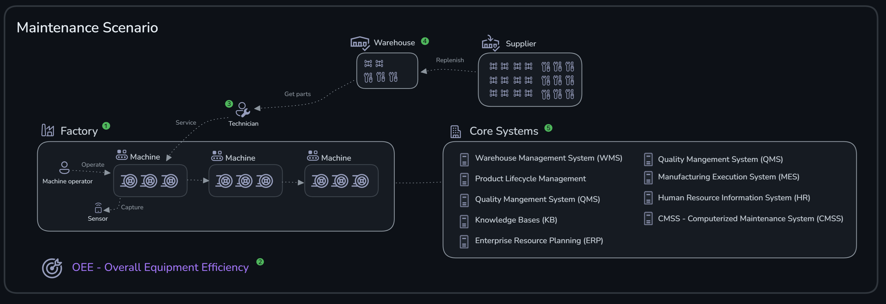
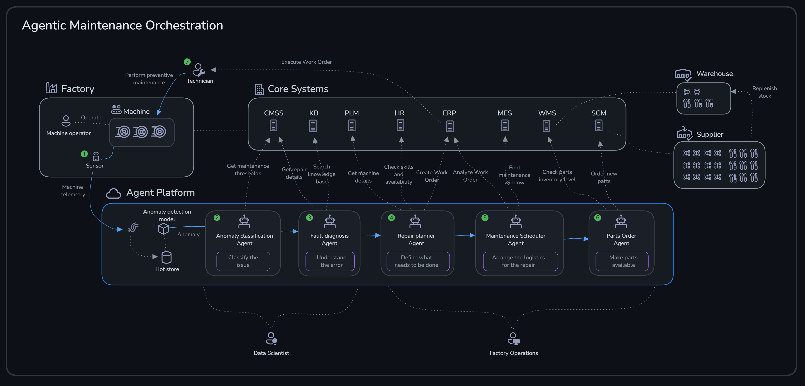
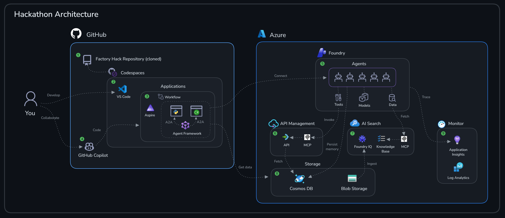

# Agentic AI Hacks | Predictive Maintenance

## Introduction

Manufacturing teams need to turn raw machine telemetry into fast, consistent
maintenance decisions. Manual triage is slow, root-cause analysis depends on
scattered historical knowledge, and coordinating parts, technicians, and
schedules across systems is hard to keep consistent.

This microhack builds an **agentic predictive maintenance workflow** for a
fictitious tire manufacturing company. You will implement five focused agents
that mirror a real maintenance process — from detecting an anomaly to
diagnosing its cause, planning the repair, scheduling a technician, and
ordering parts — using **Microsoft Agent Framework**, **Microsoft Foundry**,
and **Azure**.

During this microhack, you will build individual agent applications (mostly in
Python, with one in .NET), connect them to shared factory data, and finally
orchestrate them into a single observable workflow hosted in **.NET Aspire**.

---

## Scenario

This microhack uses a fictitious tire manufacturing company as an example, but
the scenario is applicable to most manufacturing environments where machines
are involved in production.

The image below illustrates the conceptual scenario.



❶ The factory operates a production line made up of multiple specialized
machines, each responsible for a distinct step in tire manufacturing (mixing,
extrusion, curing, inspection).

❷ A key business metric is **Overall Equipment Effectiveness (OEE)** — how
effectively equipment is utilized during planned production time. Unplanned
downtime and quality losses directly reduce throughput and profitability.

❸ Maintenance technicians perform both *planned* (time/usage-based)
maintenance and *condition-based* maintenance triggered by sensor readings and
detected anomalies. Because machines are complex, tasks require specific
skills, certifications, and safety procedures.

❹ Spare parts are held in a local warehouse with limited stock. When
inventory falls below thresholds or parts are needed for a repair,
replenishment is coordinated with external suppliers, often with lead times
and ordering constraints.

❺ The production environment integrates with multiple core systems (WMS, ERP,
CMMS, MES, QMS, knowledge bases). These systems coordinate production,
maintenance execution, inventory, quality, and scheduling — making end-to-end
orchestration essential.

The maintenance process is complex and requires coordination across people,
parts, and systems. Common challenges include:

* Detecting when a machine needs attention, who should be notified, and how
  to prioritize the response.
* Diagnosing the root cause of irregular machine behavior using telemetry
  plus shared knowledge and historical patterns.
* Determining which parts are required, whether they are in local stock, and
  how to handle supplier lead times.
* Matching work to technicians with the right skills, certifications, and
  safety requirements.
* Scheduling technicians based on availability, shifts, and constraints
  (access windows, downtime limits).
* Finding the optimal maintenance window that minimizes production
  disruption while keeping risk acceptable.

Agents can help by coordinating data, decisions, and handoffs across these
steps. The intent is not to replace technicians or planners, but to reduce
time-to-triage and make the workflow more consistent and observable.

The image below shows the agent roles used in this microhack and how they
interact with telemetry and existing factory systems.



❶ Telemetry is emitted from machine sensors and evaluated for deviations
(simple thresholds or an anomaly detection model).

❷ The **Anomaly Classification Agent** classifies the situation
(normal/warning/critical), enriches it with machine context, and raises an
alert with an appropriate priority.

❸ The **Fault Diagnosis Agent** proposes likely root causes using telemetry
plus documented historical knowledge (runbooks, prior work orders, technician
notes).

❹ The **Repair Planner Agent** translates a diagnosis into an actionable
repair plan — required parts, estimated effort, and required
skills/certifications — and drafts a work order for review.

❺ The **Maintenance Scheduler Agent** proposes a maintenance window based on
priority/risk, technician availability, and production constraints.

❻ The **Parts Ordering Agent** checks inventory and suggests replenishment
orders based on supplier lead times and constraints.

The factory process spans many systems, teams, and areas of responsibility.
This microhack embraces that reality: agents stay independent, but are
designed to collaborate through well-defined inputs/outputs and shared
observability.

---

## Architecture

You will build multiple agent applications (Python and .NET) and connect them
using a sequential workflow in the **Microsoft Agent Framework**. The workflow
itself is described in the scenario section above; the image below shows the
supporting platform components.



❶ The documentation, starter code, and sample assets are available in this
repository, opened directly from your assigned lab account.

❷ **GitHub Codespaces** provides a containerized development environment with
the required tools and extensions pre-installed, so everyone starts from a
known baseline.

❸ You will build individual agent applications (mostly in Python, with one in
.NET) and eventually run the end-to-end workflow locally using **Aspire**,
which also gives you a single place to start the system and inspect service
logs.

❹ **GitHub Copilot** is used to co-develop parts of the solution — one
challenge uses it to build an agent from scratch — and you can use it
throughout the microhack for implementation, refactoring, and troubleshooting.

❺ Agents are registered in **Microsoft Foundry** and configured with the
selected model deployments plus the tools and data connections they need.

❻ **API Management** acts as an AI gateway for selected endpoints. When
needed, agents access those APIs via **MCP**, which provides a consistent
interface for tool calling.

❼ **Foundry IQ / knowledge sources** provide content for retrieval-augmented
generation (RAG), such as machine documentation, troubleshooting guides, and
historical notes.

❽ Factory data (machines, thresholds, inventory, work orders) is stored in
**Cosmos DB** and **Blob Storage** and used by agents during analysis and
planning.

❾ **Application Insights** (and related logs/traces) provides observability
across the workflow so you can troubleshoot agent behavior, tool calls, and
end-to-end requests.

> [!NOTE]
> Manufacturing environments are complex: legacy systems, safety
> requirements, strict uptime targets, and processes that exist for good
> reasons — often split across distributed teams and both IT and OT domains.
>
> This microhack uses a deliberately simplified lab setup so you can focus on
> the learning objectives and the core patterns of agentic development
> (workflow design, tool integration, and observability), rather than the
> full complexity of factory networking, governance, and infrastructure.

### The five agents

| Agent                          | Role                                                                 | Data source or control                        | Introduced in |
|---------------------------------|-----------------------------------------------------------------------|------------------------------------------------|---------------|
| Anomaly Classification Agent    | Classifies telemetry deviations and raises prioritized alerts         | Machine thresholds and telemetry               | Challenge 2   |
| Fault Diagnosis Agent           | Proposes likely root causes                                           | Knowledge base and maintenance history         | Challenge 2   |
| Repair Planner Agent            | Drafts a repair plan and work order                                   | Parts inventory and technician skills          | Challenge 3   |
| Maintenance Scheduler Agent     | Proposes a maintenance window                                        | Technician availability and production windows | Challenge 4   |
| Parts Ordering Agent            | Checks inventory and suggests replenishment                          | Parts inventory and suppliers                  | Challenge 4   |

---

## Learning objectives

By participating in this microhack, you will learn how to:

* Implement five focused agents and connect them to data and tools
* Use GitHub Copilot, including a custom `agentplanning` coding agent, to
  accelerate agent development while keeping changes reviewable
* Add persistent agent memory (threads) for maintenance scenarios where
  history matters
* Instrument agents so you can inspect outputs, tool calls, logs, and traces
* Build an end-to-end agent workflow using the Microsoft Agent Framework and
  sequential orchestration hosted in **Aspire**, with agent-to-agent (A2A)
  communication

---

## Requirements

To complete the microhack, you will need:

* A [GitHub account](https://github.com/signup) and access to the repository
* Familiarity with Python or .NET, including handling JSON data and making API calls
* Familiarity with generative AI solutions and Azure services
* Python 3.11+ and [uv](https://docs.astral.sh/uv/), plus .NET 10 (provided in
  the devcontainer)
* Azure resources and environment values supplied by the MicroHack platform or
  your event coach

### Participant setup

Complete all environment preparation in
[Challenge 1: Environment Setup and Data Foundation](./challenges/challenge-01.md).
It covers the Codespaces setup, dependency installation, Azure authentication,
and validation required before beginning the build challenges.

---

## Repository structure

```text
08_Predictive_Maintenance/
|-- challenges/                 # Challenge instructions (challenge-01 through challenge-05)
|-- data/                       # Sample factory data (machines, thresholds, work orders, knowledge base)
|-- src/                        # Starter and required agent code, and the end-to-end workflow app
|-- labautomation/              # MicroHack provisioning and Azure deployment template
|-- walkthrough/                # Reference solutions and optional supplementary material per challenge
|-- .github/agents/             # Custom GitHub Copilot agent used in Challenge 3
|-- pyproject.toml              # Pinned participant Python environment
`-- README.md
```

| Path                                   | Who uses it                | Purpose                                                       |
|-----------------------------------------|-----------------------------|----------------------------------------------------------------|
| [`challenges/`](./challenges/)         | Attendees                   | Step-by-step instructions for the five challenges              |
| [`data/`](./data/)                     | Attendees and scripts       | Sample factory data used by the agents                         |
| [`src/`](./src/)                       | Attendees                   | Required starter agents and the end-to-end workflow application |
| [`labautomation/`](./labautomation/)   | Platform and coaches        | Per-lab provisioning and Azure Bicep deployment template        |
| [`walkthrough/`](./walkthrough/)       | Facilitators and attendees  | Reference solutions and optional/supplementary material per challenge |
| [`.github/agents/`](./.github/agents/) | Attendees                   | Custom Copilot agent (`agentplanning`) used in Challenge 3      |

---

## Challenges

This microhack is divided into five challenges, each building on the previous
one. You'll start by setting up your environment, then progressively build
individual agents, and finally orchestrate them into a complete workflow.

### Challenge structure

Each challenge follows a consistent structure:

| Section | Description |
|---------|-------------|
| 🎯 **Objective** | Learning goals for the challenge |
| 🧭 **Context and Background** | Scenario explanation, architecture diagrams, and technical concepts |
| ✅ **Tasks** | Step-by-step instructions to complete the challenge |
| 🚀 **Go Further** | Optional stretch goals if you finish early |
| 🛠️ **Troubleshooting** | Common problems and solutions |
| 🧠 **Conclusion and Reflection** | Recap, key takeaways, and further reading |

Each challenge also includes a **"Stuck? See the walkthrough"** callout that
links to the matching `walkthrough/challenge-XX/solution-XX.md`, which adds
prerequisites, exact commands, expected results, troubleshooting, and a
validation checklist without repeating the challenge narrative.

### Challenge list

| # | Challenge | Description | Duration |
|---|-----------|-------------|----------|
| 1 | [Environment Setup and Data Foundation](./challenges/challenge-01.md) | Deploy Azure resources, configure environment variables, and seed sample factory data | 30 min |
| 2 | [Anomaly Detection and Fault Diagnosis Agents](./challenges/challenge-02.md) | Build an Anomaly Classification Agent and a Fault Diagnosis Agent for tire manufacturing telemetry | 60 min |
| 3 | [Repair Planner Agent and AI-Driven Development](./challenges/challenge-03.md) | Use the custom `agentplanning` Copilot agent to build a Repair Planner Agent in .NET | 60 min |
| 4 | [Maintenance Scheduler and Parts Ordering Agents](./challenges/challenge-04.md) | Build Scheduler and Parts Ordering agents with persistent memory and observability | 60 min |
| 5 | [Multi-Agent Orchestration](./challenges/challenge-05.md) | Compose the five agents into a workflow with Microsoft Agent Framework, hosted in Aspire | 60 min |

> [!TIP]
> While it's possible to rush through the challenges, we encourage you to pause
> and reflect along the way. Consider how each pattern relates to your own
> context: what business processes in your environment could benefit from
> coordinated AI agents?

### Solution walkthroughs

* [Challenge 1 walkthrough](./walkthrough/challenge-01/solution-01.md)
* [Challenge 2 walkthrough](./walkthrough/challenge-02/solution-02.md)
* [Challenge 3 walkthrough](./walkthrough/challenge-03/solution-03.md)
* [Challenge 4 walkthrough](./walkthrough/challenge-04/solution-04.md)
* [Challenge 5 walkthrough](./walkthrough/challenge-05/solution-05.md)

---

## Contributing

This project welcomes contributions and suggestions. Most contributions require you to
agree to a Contributor License Agreement (CLA) declaring that you have the right to,
and do, grant us the rights to use your contribution. For details, visit the
[Microsoft CLA website](https://cla.opensource.microsoft.com/).

This project has adopted the
[Microsoft Open Source Code of Conduct](https://opensource.microsoft.com/codeofconduct/).
For more information, see the
[Code of Conduct FAQ](https://opensource.microsoft.com/codeofconduct/faq/) or contact
[opencode@microsoft.com](mailto:opencode@microsoft.com).

## Trademarks

This project may contain trademarks or logos for projects, products, or services.
Authorized use of Microsoft trademarks or logos is subject to the
[Microsoft Trademark and Brand Guidelines](https://www.microsoft.com/legal/intellectualproperty/trademarks/usage/general).
Use of Microsoft trademarks or logos in modified versions of this project must not
cause confusion or imply Microsoft sponsorship. Any use of third-party trademarks or
logos is subject to those third parties' policies.

