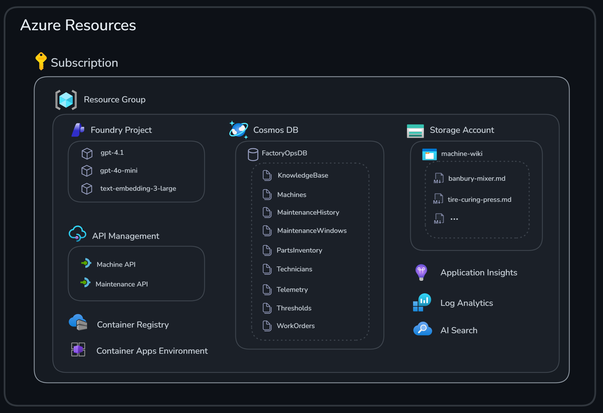

# Challenge 1 - Environment Setup and Data Foundation

**[Home](../README.md)** | [Next challenge](challenge-02.md)

> [!TIP]
> Stuck on a step? See the [Challenge 1 walkthrough](../walkthrough/challenge-01/solution-01.md) for exact commands, expected output, and a validation checklist.

## 🎯 Objective

Sign in with your assigned lab credentials, verify the pre-provisioned Azure resources and seeded factory data, and start the GitHub Codespaces development environment used throughout the rest of this microhack.

## 🧭 Context and Background

Before you can build any agents, the tire factory's data foundation and Azure resources need to be in place. The MicroHack platform provisions and seeds these ahead of time so you can focus on building agents rather than infrastructure. All resources for your lab live in a single Azure resource group, as illustrated below.



* A **Foundry Account** and **Foundry Project** with model deployments for `gpt-5.4`, `gpt-5.4-mini`, and `text-embedding-3-large`
* **API Management** with API proxies that read data from Cosmos DB
* **Cosmos DB** with containers for machines, thresholds, telemetry, the knowledge base, parts inventory, technicians, and work orders
* A **Storage account** with knowledge base wiki articles in Markdown
* **Azure AI Search** to query the wiki knowledge base
* **Application Insights** and **Log Analytics** for observability
* **Container Registry** and a **Container Apps Environment** for the agents you deploy in later challenges

<details>
<summary>Cosmos DB data model (7 containers)</summary>

| Container | Partition key | Purpose | Sample count |
|-----------|--------------|---------|--------------|
| `Machines` | `/type` | Equipment definitions | 5 machines |
| `Thresholds` | `/machineType` | Operating limits | 13 thresholds |
| `Telemetry` | `/machineId` | Sensor readings | 10 samples |
| `KnowledgeBase` | `/machineType` | Troubleshooting articles | 10 articles |
| `PartsInventory` | `/category` | Spare parts | 16 parts |
| `Technicians` | `/department` | Maintenance staff | 6 technicians |
| `WorkOrders` | `/status` | Maintenance history | 5 work orders |

</details>

<details>
<summary>Seeded telemetry anomalies you will investigate in later challenges</summary>

* 🔴 **Machine 001** (Tire Curing Press A1): Temperature 179.2°C — exceeds the 178°C warning threshold
* 🔴 **Machine 002** (Tire Building Machine B1): Drum vibration 3.2 mm/s — exceeds 3.0 mm/s
* 🔴 **Machine 003** (Tire Extruder C1): Throughput 640 kg/h — below the 650 kg/h minimum
* 🔴 **Machine 004** (Tire Uniformity Machine D1): Radial force variation 105 N — exceeds 100 N
* 🔴 **Machine 005** (Banbury Mixer E1): Multiple warnings across temperature, power, and vibration

</details>

The remaining challenges use this pre-provisioned environment and a repository hosted on GitHub. You will work from a GitHub Codespace configured with the Python, .NET, and Azure tooling required to build the predictive maintenance agents.

Complete this setup with the credentials provided in your Hackbox. Use the assigned lab account rather than a personal or work account so that you have access to the correct Azure subscription, resource group, GitHub organization, and repository.

## ✅ Tasks

### 1. Sign in to Azure

Open the [Azure portal](https://portal.azure.com) and sign in with the credentials provided in your Hackbox, choosing **Use another account** when prompted.

In the Azure portal, select **Resource groups**, open the resource group assigned to you, and confirm that its resources have been deployed successfully. Verify that you can see the Foundry project, the Cosmos DB account, the Storage account, and the API Management instance described in [Context and Background](#-context-and-background).

### 2. Sign in to GitHub

Open [GitHub](https://github.com) and sign in with the credentials provided in your Hackbox, choosing **Use another account** and then **Sign in with your identity provider**.

Open the organization associated with your lab account and select the `MicroHack` repository. Confirm that you can see the repository files and folders, including `03-Azure/01-04-AI/08_Predictive_Maintenance`.

### 3. Create the development environment

From the repository page, select **Code**, open the **Codespaces** tab, then use the `...` menu to choose **New with options**. For **Dev container configuration**, select **Azure / AI / Predictive Maintenance**, then select **Create codespace**.

GitHub opens the Codespace in a new browser tab. Wait for the container setup to finish, then confirm that the repository files are visible in the Explorer and that the integrated terminal opens without errors.

Open a terminal in the Codespace and verify that the required tools are installed:

```bash
az --version
dotnet --version
```

Install the pinned Python dependencies and activate the environment:

```bash
uv sync --frozen
source .venv/bin/activate
```

Sign in to Azure from the Codespace terminal with the assigned lab account:

```bash
az login --use-device-code
```

### 4. Retrieve environment configuration

From the repository root, run the setup script with the resource group name provided in your Hackbox:

```bash
bash labautomation/get-keys.sh --resource-group "<your-resource-group-name>"
```

The script locates your deployed lab resources and creates a local `.env` file. It retrieves the Foundry project endpoint, Cosmos DB connection details, Storage account connection string, and Azure AI Search key and endpoint required by the remaining challenges. The file is excluded from Git and its secret values are not displayed.

Make the environment variables available in your shell:

```bash
export $(grep -v '^#' .env | xargs)
```

> [!TIP]
> Re-export the environment variables each time you open a new terminal or resume a stopped Codespace.

### 5. Verify the seeded factory data

The lab deployment seeds the Cosmos DB containers and uploads the knowledge base wiki articles automatically — you do not need to run a seeding step yourself. Confirm the data is present:

```bash
az cosmosdb sql container list \
  --account-name "$COSMOS_ACCOUNT_NAME" \
  --resource-group "$RESOURCE_GROUP" \
  --database-name "FactoryOpsDB" \
  --query "[].id" --output tsv
```

You should see all seven containers listed in [Context and Background](#-context-and-background). Then confirm the knowledge base wiki articles were uploaded to Blob Storage:

```bash
az storage blob list \
  --connection-string "$AZURE_STORAGE_CONNECTION_STRING" \
  --container-name kb-wiki \
  --query "length(@)" --output tsv
```

The expected result is `5` wiki articles, one per machine type.

## 🚀 Go Further

Review the [solution architecture](../README.md#architecture) and identify which Azure resource each of the five agents will use in the upcoming challenges.

## 🛠️ Troubleshooting

* **The Azure resource group is missing:** Confirm that you signed in with the assigned lab account and selected the assigned subscription in the Azure portal.
* **`get-keys.sh` reports an authorization error:** Confirm that the Codespace is signed in with the assigned lab account, and that it can read deployment outputs and list keys for the Foundry, Cosmos DB, Storage, and Azure AI Search resources.
* **A Cosmos DB container is missing or empty, or the `kb-wiki` container has fewer than 5 blobs:** See the [Challenge 1 walkthrough](../walkthrough/challenge-01/solution-01.md) for the fallback re-seed command.
* **The GitHub organization or repository is missing:** Sign out of GitHub, then sign in again through **Sign in with your identity provider** using the Hackbox credentials.
* **The Codespace does not finish starting:** Review the creation log for the failing step, then rebuild the container or recreate the Codespace.

## 🧠 Conclusion and Reflection

You have verified the Azure resources, confirmed the seeded factory data, and opened the configured development environment. This forms the foundation for the multi-agent predictive maintenance system you will build over the next four challenges.

> [!IMPORTANT]
> This microhack uses simplified, key-based authentication and public network access for learning purposes. Production systems should implement managed identities, private endpoints, Azure Key Vault for secrets, and RBAC for fine-grained access control.

If you want to learn more about what you covered in this challenge, check out the links below:

* [Get started with Azure CLI](https://learn.microsoft.com/cli/azure/get-started-with-azure-cli)
* [Azure Cosmos DB documentation](https://learn.microsoft.com/azure/cosmos-db/)
* [Microsoft Foundry documentation](https://learn.microsoft.com/azure/ai-foundry/)
* [Azure AI Search documentation](https://learn.microsoft.com/azure/search/)
* [Predictive maintenance patterns](https://learn.microsoft.com/azure/architecture/data-guide/scenarios/predictive-maintenance)

**Next:** [Challenge 2 - Anomaly Detection and Fault Diagnosis Agents](challenge-02.md)
