# Challenge 2 - Anomaly Detection and Fault Diagnosis Agents

**[Home](../README.md)** | [Previous challenge](challenge-01.md) | [Next challenge](challenge-03.md)

> [!TIP]
> Stuck on a step? See the [Challenge 2 walkthrough](../walkthrough/challenge-02/solution-02.md) for exact commands, expected output, and a validation checklist.

## 🎯 Objective

The goals for this challenge are:

* Create two Foundry Agents in Python: an **Anomaly Classification Agent** and a **Fault Diagnosis Agent**
* Use MCP servers exposed through API Management for remote tool invocation
* Ground the Fault Diagnosis Agent with your own data using **Foundry IQ**

## 🧭 Context and Background

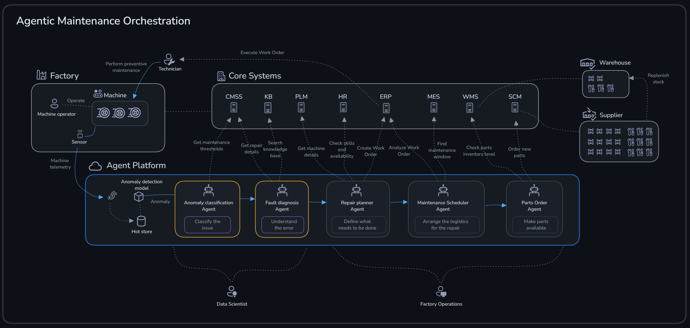

The **Anomaly Classification Agent** interprets detected anomalies and raises corresponding maintenance alerts. The **Fault Diagnosis Agent** determines the root cause of an anomaly so a technician can prepare for maintenance. Both agents use a number of different tools to accomplish their tasks.

You will use the Azure resources highlighted in the image below.

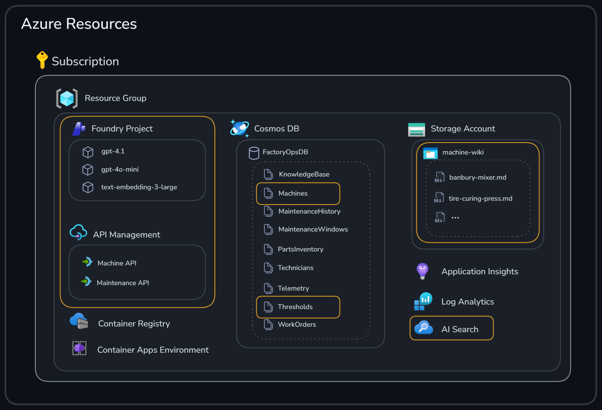

### Model Context Protocol (MCP)

You will use **Model Context Protocol (MCP)** to connect the agents with remote tools. MCP is a standard way for an agent to discover and invoke external capabilities ("tools") through a consistent interface.

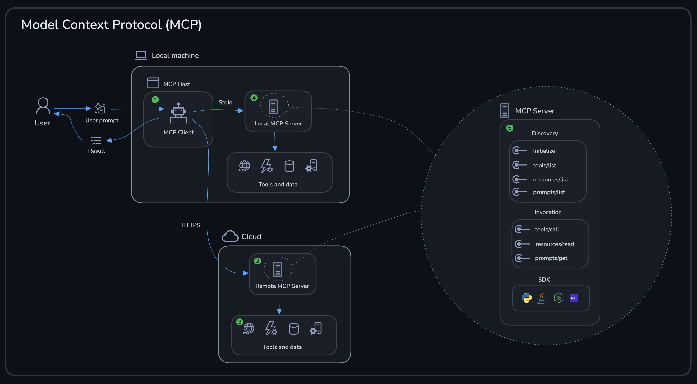

Let's break down the key components shown in the diagram:

#### ❶ MCP Host and MCP Client

An **MCP Host** is the application that runs agents and manages MCP connections. Inside the host lives one or more **MCP Clients** that handle communication with MCP servers. Examples include:

| MCP Host | MCP Client | Description |
|----------|------------|-------------|
| VS Code | GitHub Copilot extension | Copilot acts as the MCP client, connecting to servers for code tools |
| Your Python script | Agent SDK client | The agents you build in this challenge — the `MCPTool` object creates an MCP client |

#### ❷ Remote MCP Server (HTTPS)

A **remote MCP server** runs in the cloud and communicates over HTTPS. This is ideal for enterprise APIs that need to be accessed securely, shared services used by multiple agents, and APIs that require authentication and rate limiting. In this challenge, you expose APIs via **API Management** as remote MCP servers.

#### ❸ Tools and Data

MCP servers provide access to **tools** (actions the agent can invoke) and **data** (information the agent can retrieve). The server defines tool names and descriptions, input/output schemas (JSON Schema), and the actual implementation that fetches data or performs actions.

#### ❹ Local MCP Server (stdio)

A **local MCP server** runs on the same machine as the host and communicates via standard input/output (stdio). Useful for development and testing, tools that need local file system access, and quick prototyping without cloud deployment.

#### ❺ MCP Server Internals

Whether remote or local, every MCP server implements the same protocol:

| Component | Purpose |
|-----------|---------|
| Discovery API | `GET /mcp` — returns available tools with their schemas |
| Invocation API | `POST /mcp/tools/{tool}` — executes a specific tool |
| SDKs | Libraries in Python, TypeScript, and C# to simplify building servers |

While you *could* build an MCP server yourself using an SDK, there are easier ways of doing it *without writing any code*. The next section shows how API Management lets you expose existing APIs as MCP servers.

### API Management as AI gateway

In this challenge, the tools live behind remote MCP servers hosted in **API Management** that expose existing API operations. Why use API Management here:

* **Decouples the agent from integrations**: the agent calls a tool by name and schema, not by hardcoding HTTP requests.
* **Reusable and portable**: the same agent code can work across environments as long as the MCP server URL/connection is configured.
* **Governance hooks**: tools can be allow-listed and can require (or skip) approval depending on your scenario.

The diagram below illustrates how API Management serves as an AI gateway, bridging traditional API patterns with the new requirements of agentic applications.

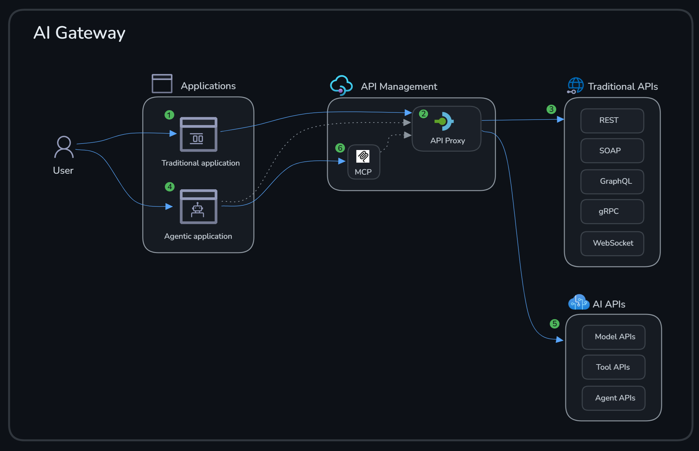

| # | Component | Description |
|---|-----------|-------------|
| ❶ | Traditional Application | APIs have been used for many years to integrate applications with remote systems. This is the foundation we build upon. |
| ❷ | API Proxy (APIM) | API Management is a mature platform that shields backend systems and adds quality-of-service capabilities such as throttling, security, and caching. |
| ❸ | Traditional Backend APIs | Backend services exposed via REST, SOAP, GraphQL, and other protocols that your applications consume. |
| ❹ | Agentic Application | We use APIs just like traditional applications to build the full solution. However, agentic applications introduce new requirements around AI model integration and tool discovery. |
| ❺ | AI APIs | Model APIs where APIM policies enable token limiting, token metrics emission, model load balancing, and content safety — all using built-in APIM functionality applied in new ways for AI workloads. |
| ❻ | MCP in APIM | A standard API can easily be exposed in APIM as an MCP server without writing any code. This is exactly what you will do in this challenge — turning existing APIs into tools that agents can discover and invoke. |

### Grounding with Foundry IQ

You will also ground the Fault Diagnosis Agent with data using **Foundry IQ**, a retrieval-augmented generation (RAG) capability in Microsoft Foundry that enables agents to access and reason over your enterprise data. It provides a managed knowledge retrieval layer powered by Azure AI Search, letting your agent retrieve relevant chunks from your own documents at runtime instead of pasting wiki content into prompts.

Key benefits of Foundry IQ:

* **Simplified development**: no need to build custom RAG pipelines — Foundry IQ handles chunking, indexing, and retrieval for you.
* **Flexible data integration**: connect multiple data sources to a single knowledge base.
* **Enhanced agent capabilities**: agents can access up-to-date enterprise knowledge without retraining the model.

Foundry IQ consists of two main concepts:

| Concept | Description |
|---------|-------------|
| Knowledge Sources | The *what* to retrieve — connections to your data. These define where the content comes from. |
| Knowledge Bases | The *how* to retrieve — the retrieval configuration that combines one or more knowledge sources into a queryable endpoint. |

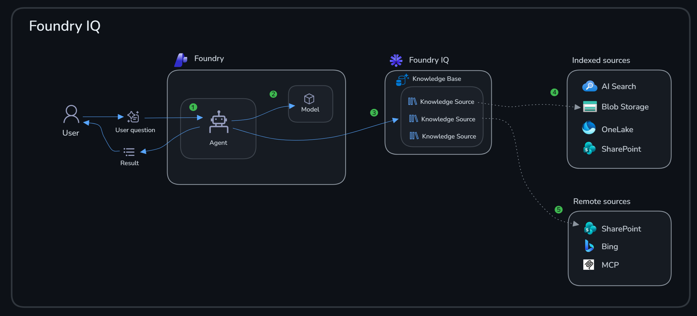

| # | Component | Description |
|---|-----------|-------------|
| ❶ | End User | The agent receives questions from the end user and processes them. |
| ❷ | Large Language Model | The agent uses a large language model to reason about the question and determine the next action. |
| ❸ | Knowledge Base | Foundry IQ provides a knowledge base with several knowledge sources that the agent can query. |
| ❹ | Indexed Sources | Pre-indexed sources like Azure AI Search indexes, Azure Blob Storage, and Azure Data Lake. Content is indexed ahead of time for fast vector and keyword retrieval. |
| ❺ | Remote Sources | On-demand sources like SharePoint and Bing that are queried at runtime. Useful for real-time data that changes frequently. |

In this challenge, you will use Foundry IQ to make the machine wiki available to the Fault Diagnosis Agent via an MCP tool.

## ✅ Tasks

### Task 1: Create and test the initial Anomaly Classification Agent

As a first step, create an agent to interpret and classify anomalies and raise maintenance alerts if certain thresholds have been violated. The agent takes anomalies for specific machines as input and checks them against thresholds for that machine type by using JSON data stored in Cosmos DB.

#### Task 1.1: Review the initial code

Examine the Python code in [`src/agents/anomaly_classification_agent.py`](../src/agents/anomaly_classification_agent.py). A few things to observe:

* The agent uses two function tools: `get_thresholds` retrieves specific metric threshold values for certain machine types, and `get_machine_data` fetches details about machines such as id, model, and maintenance history.
* The agent is instructed to output both structured alert data in a specific format and a human-readable summary.
* The code creates the agent and runs a sample query against it.

#### Task 1.2: Run the code

```bash
python src/agents/anomaly_classification_agent.py
```

Verify that the agent responds with a reasonable answer that classifies the sample anomaly and includes a human-readable summary.

### Task 2: Equip the agent with MCP tools

Machine and threshold information is typically stored in a central system and exposed through an API. Adjust the data access to use existing Machine and Maintenance APIs instead of accessing Cosmos DB directly, by exposing those APIs as MCP servers.

#### Task 2.1: Test the Machine API

The Machine API and Maintenance API are already available in API Management and contain endpoints for getting details about a specific machine and thresholds for certain machine types. Try the APIs:

```bash
# Get all machines
curl -fsSL "$APIM_GATEWAY_URL/machine" -H "Ocp-Apim-Subscription-Key: $APIM_SUBSCRIPTION_KEY" -H "Accept: application/json"

# Get a specific machine
curl -fsSL "$APIM_GATEWAY_URL/machine/machine-001" -H "Ocp-Apim-Subscription-Key: $APIM_SUBSCRIPTION_KEY" -H "Accept: application/json"

# Get thresholds for a machine type
curl -fsSL "$APIM_GATEWAY_URL/maintenance/tire_curing_press" -H "Ocp-Apim-Subscription-Key: $APIM_SUBSCRIPTION_KEY" -H "Accept: application/json"
```

#### Task 2.2: Expose APIs as MCP servers

API Management provides an easy way to expose APIs as MCP servers without writing any additional wrapper code.

❶ Navigate to your API Management instance in the [Azure portal](https://portal.azure.com).

❷ Choose **APIs** and notice that the *Machine API* and *Maintenance API* you tested earlier are available.

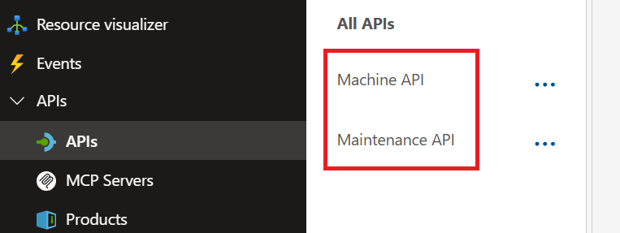

❸ Navigate to the **MCP Servers** section.

❹ Select **Create MCP Server** and **Expose an API as MCP Server**.

❺ Select the API, operations, and provide the following details:

* **API**: *Machine API*
* **API Operations**: *Get Machine*
* **Display Name**: *Get Machine Data*
* **Name**: `get-machine-data`
* **Description**: *Gets details about a specific machine*

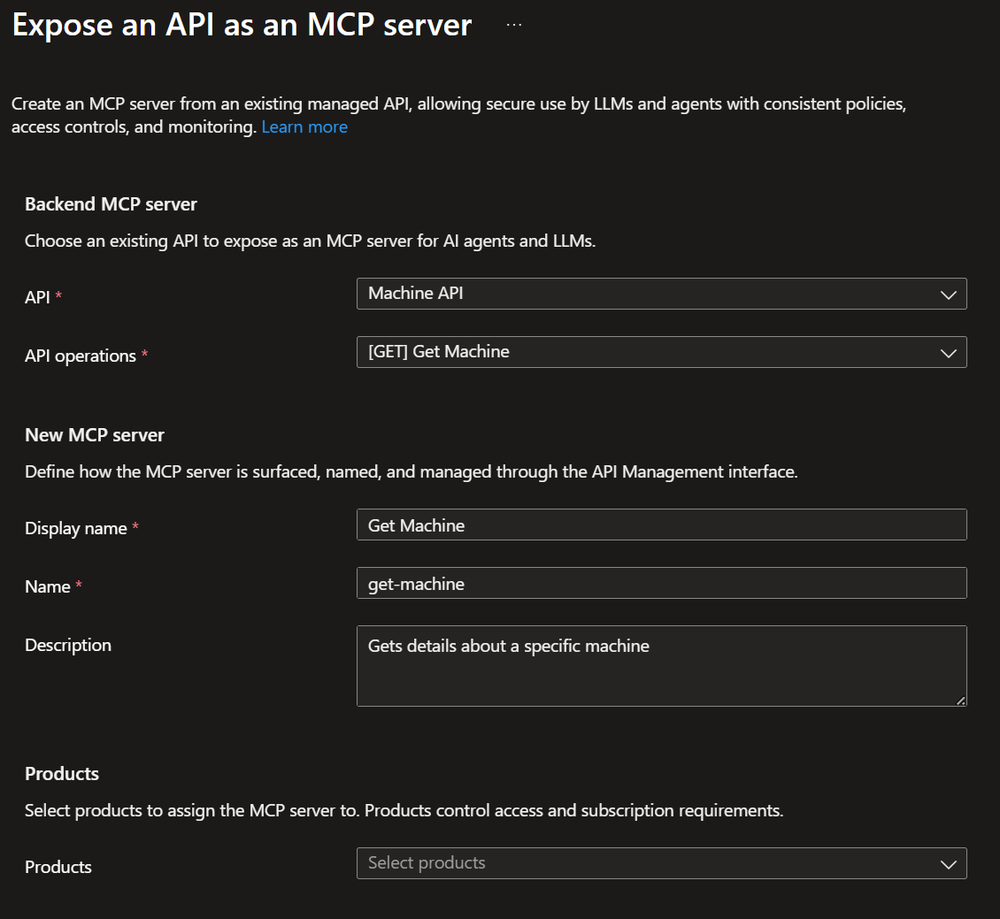

❻ Select **Create**.

❼ Copy the *MCP Server URL* of the newly created MCP server.

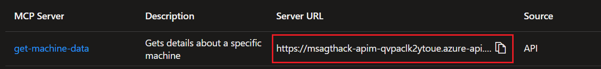

❽ Add a new entry to the `.env` file: `MACHINE_MCP_SERVER_ENDPOINT="<MCP_SERVER_URL>"`.

Repeat the same steps to create the *Maintenance* MCP server using the following settings:

* **API**: *Maintenance API*
* **API Operations**: *Get Threshold*
* **Display Name**: *Get Maintenance Data*
* **Name**: `get-maintenance-data`
* **Description**: *Gets maintenance data such as thresholds for maintenance alerts*

Save the MCP Server URL as `MAINTENANCE_MCP_SERVER_ENDPOINT="<MCP_SERVER_URL>"`, then reload the environment variables:

```bash
export $(grep -v '^#' .env | xargs)
```

#### Task 2.3: Use the MCP servers from the agent

Replace the direct database access with the new Machine and Maintenance MCP servers, added as tools to the Anomaly Classification Agent.

Examine the Python code in [`src/agents/anomaly_classification_agent_mcp.py`](../src/agents/anomaly_classification_agent_mcp.py). A few things to observe:

* The agent uses two MCP tools: `machine-data` fetches details about machines, and `maintenance-data` retrieves specific metric threshold values.
* A project connection is created for each MCP tool.

#### Task 2.4: Test the agent with MCP tools

```bash
python src/agents/anomaly_classification_agent_mcp.py
```

Verify that the agent responds with a correct answer using the MCP tools instead of direct database access.

#### Task 2.5: Review and test the agent in the Foundry portal

❶ Navigate to the [Foundry portal](https://ai.azure.com).

> [!TIP]
> Make sure you are using the new Foundry portal experience. You might need to enable it using the toggle in the upper right corner.
>
> 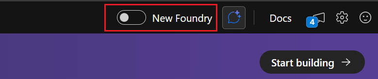

❷ Select the **Build** tab to list available agents.

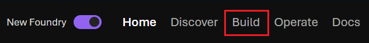

❸ Examine the configuration details for `AnomalyClassificationAgent`.

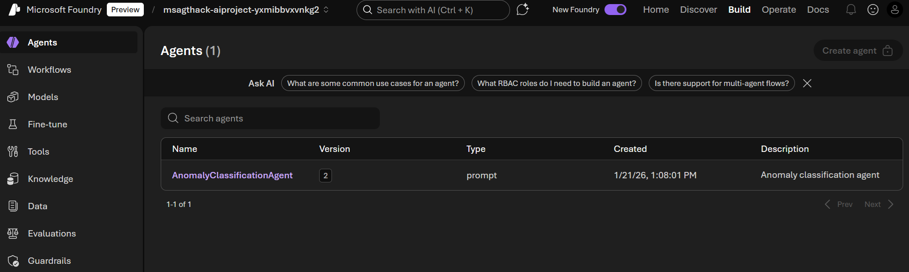

> [!NOTE]
> There are two versions of the Anomaly Classification Agent: one for the initial agent with local tools, and one for the version that uses MCP tools.

❹ Select the Anomaly Classification Agent and try out some additional questions in the playground:

* Normal condition (no maintenance needed). Use the query `Hello, can you classify the following metric for machine-002: [{"metric": "drum_vibration", "value": 2.1}]`

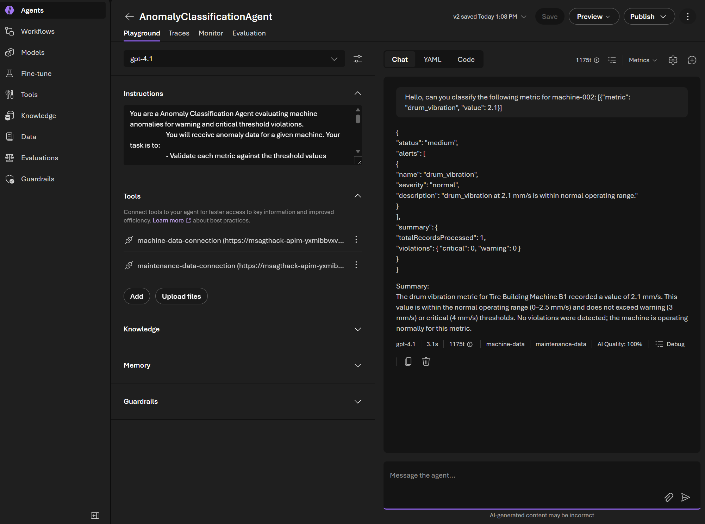

* Critical anomaly. Use the query `Hello, can you classify the following metric for machine-005: [{"metric": "mixing_temperature", "value": 175}]`

### Task 3: Understand root cause with the Fault Diagnosis Agent and Foundry IQ

The **Fault Diagnosis Agent** is tasked with understanding the actual root cause of the issues raised by the Anomaly Classification Agent. Besides machine data and maintenance history, add a machine wiki as a tool for the agent by using Foundry IQ.

#### Task 3.1: Examine the machine data wiki

The machine wiki contains knowledge (common issues, repair instructions, and repair details) about different machine types. The wiki pages are available as markdown files in Azure Blob Storage.

❶ Navigate to the [Azure portal](https://portal.azure.com) and locate the storage account.

❷ Select **Storage browser** > **Blob containers** and select the `machine-wiki` container.

❸ Select a wiki article and select the **Edit** tab to preview the content.

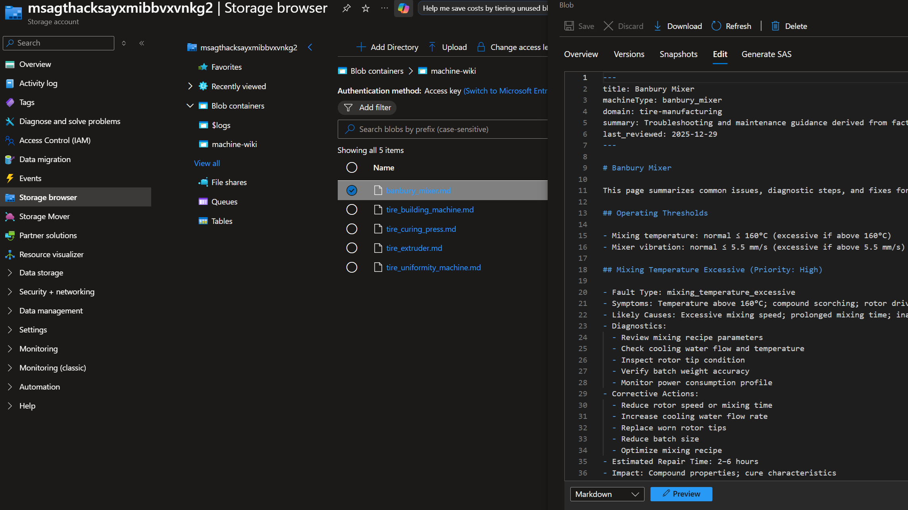

#### Task 3.2: Expose the machine wiki data as a knowledge base

Foundry IQ consists of knowledge sources (*what* to retrieve) and knowledge bases (*how* to retrieve). Knowledge sources are created as standalone objects and then referenced in a knowledge base.

> [!NOTE]
> Foundry Agent Service orchestrates calls to the knowledge base via the MCP tool and synthesizes the final answer. At runtime, the agent calls only the knowledge base, not the data platform (Azure Blob Storage in this case) that underlies the knowledge source. The knowledge base handles all retrieval operations.

Create a knowledge source and knowledge base by following the steps in [`src/create_knowledge_base.ipynb`](../src/create_knowledge_base.ipynb).

> [!TIP]
> When running the notebook you will be asked to select an environment. Pick the user-installed Python environment.
>
> 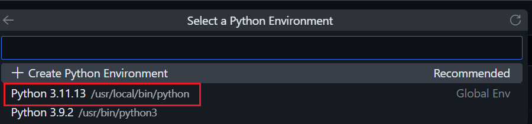

#### Task 3.3: Create the Fault Diagnosis Agent

Create the Fault Diagnosis Agent and use the newly created Foundry IQ knowledge base.

Examine the Python code in [`src/agents/fault_diagnosis_agent.py`](../src/agents/fault_diagnosis_agent.py). Currently only one tool, `machine_data`, is available. Your task is to add the knowledge base MCP tool to the agent so the machine wiki content can be used when diagnosing the root cause of the anomaly.

❶ Locate the placeholder comment `# TODO: add Foundry IQ MCP tool` in `src/agents/fault_diagnosis_agent.py`.

❷ Add the knowledge base as an `MCPTool` by replacing the placeholder with:

```python
MCPTool(
    server_label="machine-wiki",
    server_url=machine_wiki_mcp_endpoint,
    require_approval="never",
    project_connection_id="machine-wiki-connection"
)
```

A few things to observe:

* The agent now uses two MCP tools: `knowledge_base` retrieves machine wiki information for root cause analysis, and `machine_data` fetches details about machines.
* The agent is clearly instructed to use the machine knowledge base instead of its own knowledge.

Run the code:

```bash
python src/agents/fault_diagnosis_agent.py
```

Verify that the agent's answer includes a root cause, severity, and a knowledge base reference from the machine wiki.

🎉 Congratulations! You've successfully built two agents and equipped them with enterprise tools to perform their tasks.

## 🚀 Go Further

> [!NOTE]
> Finished early? These tasks are **optional** extras for exploration. Feel free to move on to the next challenge — you can always come back later!

<details>
<summary>Experiment with prompts</summary>

Try modifying the system instructions in `anomaly_classification_agent_mcp.py` or `fault_diagnosis_agent.py`. Observe how different phrasings affect the agent's responses — this is practical prompt engineering in action.

</details>

<details>
<summary>Test edge cases in the playground</summary>

Use the Foundry portal playground to test boundary conditions: non-existent machines (for example `machine-999`), metrics at exact threshold values, invalid or malformed input data, and multiple anomalies at once.

</details>

<details>
<summary>Add a new wiki article</summary>

Create a new markdown file for a machine type (copy and modify an existing article), upload it to the `machine-wiki` container in Azure Blob Storage, re-run the indexer to include the new content, and test retrieval with the Fault Diagnosis Agent.

</details>

## 🛠️ Troubleshooting

* **`Connection 'xxx-connection' not found` error when running agents:** this is a known intermittent issue with Foundry's MCP connection resolution (the service is in preview) — the connections exist but are not always resolved correctly by the agent runtime. Run the script again (the error is transient and often succeeds on retry), test in the Foundry portal playground if the agent was already created, or wait a few minutes for connection state to propagate. Verify connections exist with:

  ```bash
  az rest --method GET \
    --url "https://management.azure.com${AZURE_AI_PROJECT_RESOURCE_ID}/connections?api-version=2025-10-01-preview" \
    --query "value[].name" -o tsv
  ```

* **The agent doesn't show up in the Foundry portal:** there can be a delay before newly created agents are visible. If you don't see the agent after 10 minutes, refresh the browser or run the Python script again.
* **`PermissionDenied` when running agent creation scripts:** confirm you have the *Azure AI Developer* role on the Foundry project.

## 🧠 Conclusion and Reflection

In Task 1, you created the Anomaly Classification Agent using a Python script.

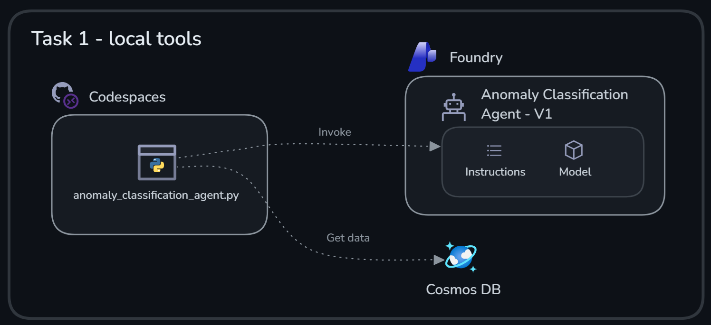

The agent had a system prompt with instructions on how to behave, and two *local* tools to query Cosmos DB data. When running the Python script, the tools executed locally in the Python process — if you asked the same questions in the Foundry portal playground, the agent wouldn't be able to answer since the tools are not available there.

> [!NOTE]
> **When do you need an agent?** This particular example could be solved *without* an agent — it's mainly mapping metrics to thresholds. The only thing AI is used for here is generating a human-readable summary of the issue. However, using an agent (besides being a learning exercise) means you can add more tools in the future for more advanced reasoning, plus built-in observability and memory (conversation history), which you'll examine in Challenge 4.
>
> You don't always need a full agent — you can call a model directly through the Azure AI Inference SDK when your use case is simpler. And agents and traditional code work well together: an agent doesn't have to perform every step in a workflow. Traditional code is often better suited for deterministic logic like validation, filtering, or data transformation. A good rule of thumb: if your agent's system instructions are becoming very long and detailed with step-by-step rules, that's often a sign that some of that logic belongs in code rather than in the prompt. Use agents for reasoning, interpretation, and decisions that benefit from flexibility, and use code for everything else.

In Task 2, you published the APIs as MCP servers in API Management and connected them to the Foundry project.

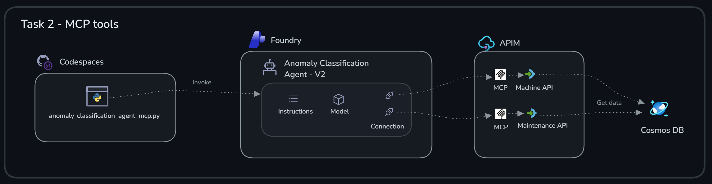

The Anomaly Classification Agent could then run fully in Agent Service, so the questions asked in the Foundry playground worked.

Finally, in Task 3, you created the Fault Diagnosis Agent and grounded it with data via AI Search exposed as an MCP server.

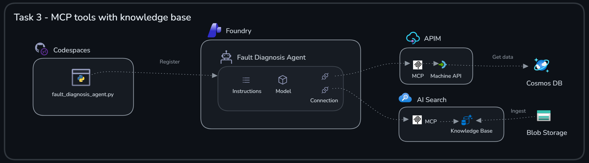

This agent also runs fully in Agent Service and can use the tools when answering questions in the playground. Note that the content from Blob Storage isn't fetched on demand — instead, it's indexed ahead of time, and retrieval queries are executed against AI Search.

If you want to learn more about what you covered in this challenge, check out the links below:

* [Model Context Protocol](https://modelcontextprotocol.io/)
* [Expose an API as an MCP server in API Management](https://learn.microsoft.com/azure/api-management/export-rest-mcp-server)
* [Foundry IQ overview](https://learn.microsoft.com/azure/ai-foundry/concepts/foundry-iq)
* [Azure AI Search documentation](https://learn.microsoft.com/azure/search/)

**Next:** [Challenge 3 - Repair Planner Agent and AI-Driven Development](challenge-03.md)
