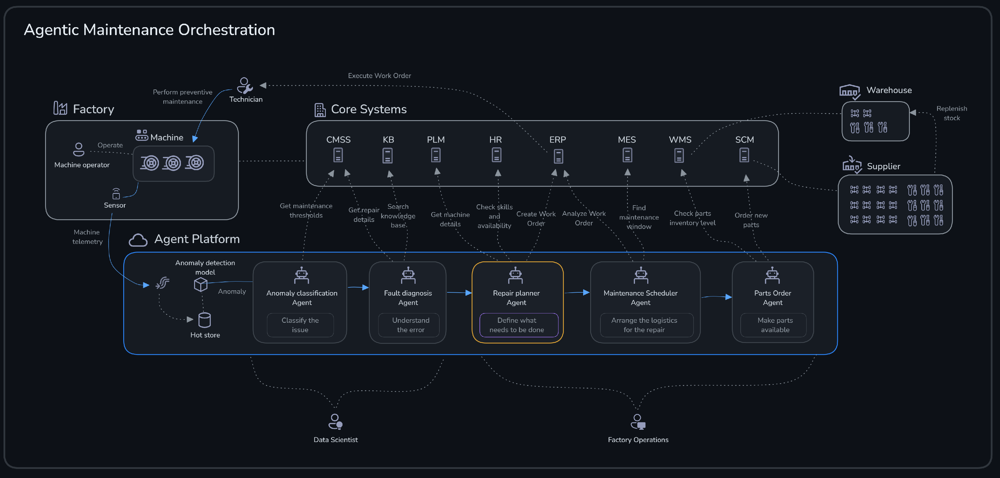
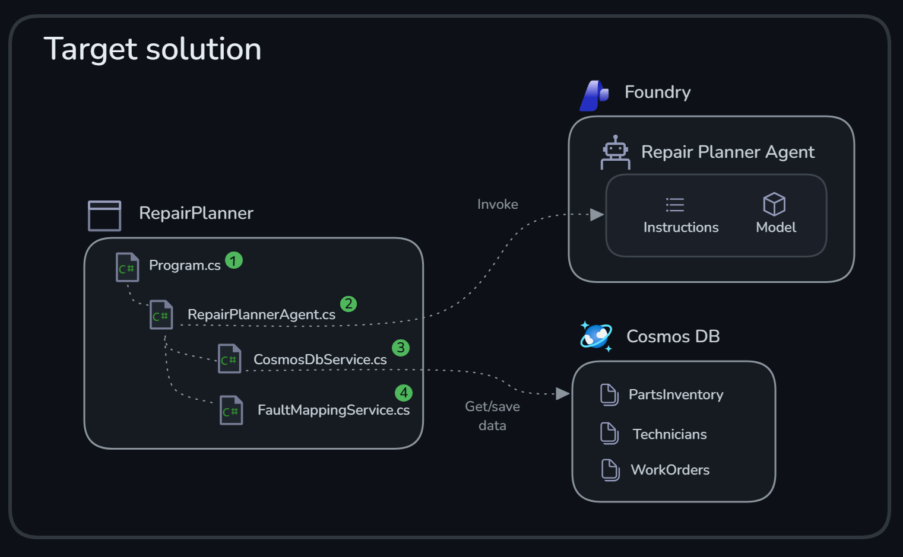
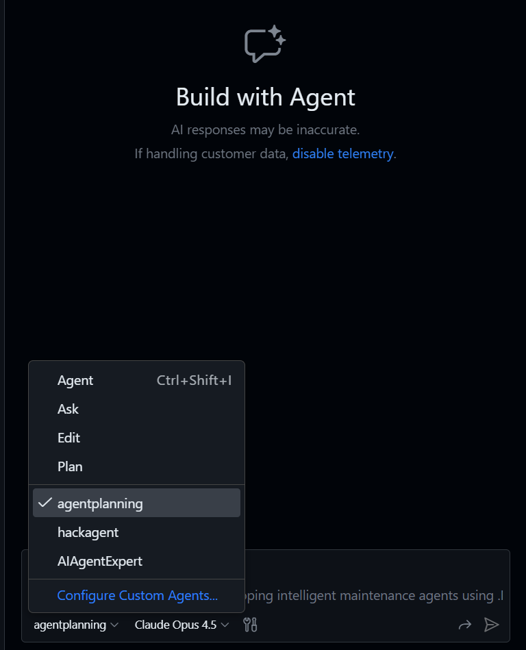
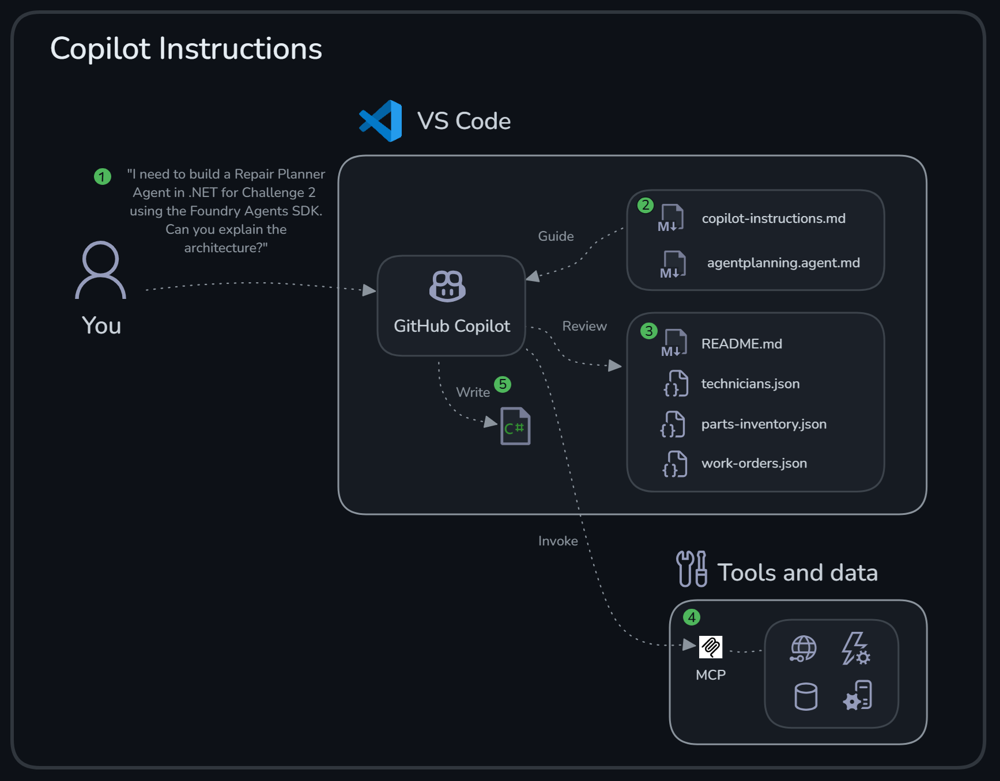

# Challenge 3 - Repair Planner Agent and AI-Driven Development

**[Home](../README.md)** | [Previous challenge](challenge-02.md) | [Next challenge](challenge-04.md)

> [!TIP]
> Stuck on a step? See the [Challenge 3 walkthrough](../walkthrough/challenge-03/solution-03.md) for exact commands, expected output, and a validation checklist.

## 🎯 Objective

The goals for this challenge are:

* Pair program with GitHub Copilot to build an agent from scratch
* Create a .NET agent using the Foundry Agents SDK
* Understand the similarities between a coding assistant (like GitHub Copilot) and a Foundry Agent — both use instructions, tools, and an LLM to accomplish tasks

## 🧭 Context and Background



The **Repair Planner Agent** is the third component in the multi-agent system. After a fault has been diagnosed, this agent determines what repair tasks need to be performed, finds technicians with the required skills, checks parts inventory, and creates a structured work order.

You will implement the Repair Planner Agent as a .NET application that reads information about `Technicians` and `PartsInventory` from Cosmos DB. The final work order is also saved in Cosmos DB. The following diagram illustrates the target solution.



❶ The **Repair Planner** is a .NET console application with `Program.cs` as its entry point.

❷ The `RepairPlannerAgent.cs` class registers the agent and orchestrates calls to other services.

❸ The `CosmosDbService.cs` class encapsulates Cosmos DB data access.

❹ In this exercise, the mappings between faults and required skills/parts are done as a static mapping in `FaultMappingService.cs`. In a real-world application, this would be fetched from another system.

> [!TIP]
> This is just one way to structure the solution — there are many valid approaches! If you have experience with .NET, feel free to experiment with a different architecture (for example dependency injection, separate class libraries, or different layering patterns). The goal, though, is to have GitHub Copilot write the majority of the code while you provide guidance and review.

The following mappings are used in this exercise. The `agentplanning` agent already knows these mappings, so you don't need to copy them manually.

<details>
<summary>Fault → Required Skills</summary>

* `curing_temperature_excessive` → `tire_curing_press`, `temperature_control`, `instrumentation`, `electrical_systems`, `plc_troubleshooting`, `mold_maintenance`
* `curing_cycle_time_deviation` → `tire_curing_press`, `plc_troubleshooting`, `mold_maintenance`, `bladder_replacement`, `hydraulic_systems`, `instrumentation`
* `building_drum_vibration` → `tire_building_machine`, `vibration_analysis`, `bearing_replacement`, `alignment`, `precision_alignment`, `drum_balancing`, `mechanical_systems`
* `ply_tension_excessive` → `tire_building_machine`, `tension_control`, `servo_systems`, `precision_alignment`, `sensor_alignment`, `plc_programming`
* `extruder_barrel_overheating` → `tire_extruder`, `temperature_control`, `rubber_processing`, `screw_maintenance`, `instrumentation`, `electrical_systems`, `motor_drives`
* `low_material_throughput` → `tire_extruder`, `rubber_processing`, `screw_maintenance`, `motor_drives`, `temperature_control`
* `high_radial_force_variation` → `tire_uniformity_machine`, `data_analysis`, `measurement_systems`, `tire_building_machine`, `tire_curing_press`
* `load_cell_drift` → `tire_uniformity_machine`, `load_cell_calibration`, `measurement_systems`, `sensor_alignment`, `instrumentation`
* `mixing_temperature_excessive` → `banbury_mixer`, `temperature_control`, `rubber_processing`, `instrumentation`, `electrical_systems`, `mechanical_systems`
* `excessive_mixer_vibration` → `banbury_mixer`, `vibration_analysis`, `bearing_replacement`, `alignment`, `mechanical_systems`, `preventive_maintenance`

</details>

<details>
<summary>Fault → Required Parts</summary>

* `curing_temperature_excessive` → `TCP-HTR-4KW`, `GEN-TS-K400`
* `curing_cycle_time_deviation` → `TCP-BLD-800`, `TCP-SEAL-200`
* `building_drum_vibration` → `TBM-BRG-6220`
* `ply_tension_excessive` → `TBM-LS-500N`, `TBM-SRV-5KW`
* `extruder_barrel_overheating` → `EXT-HTR-BAND`, `GEN-TS-K400`
* `low_material_throughput` → `EXT-SCR-250`, `EXT-DIE-TR`
* `high_radial_force_variation` → (empty array)
* `load_cell_drift` → `TUM-LC-2KN`, `TUM-ENC-5000`
* `mixing_temperature_excessive` → `BMX-TIP-500`, `GEN-TS-K400`
* `excessive_mixer_vibration` → `BMX-BRG-22320`, `BMX-SEAL-DP`

</details>

### Using the custom GitHub Copilot agent (agentplanning)

GitHub Copilot custom agents in VS Code are reusable, task-specific chat personas. A custom agent bundles a set of instructions (how Copilot should behave) and an allowed set of tools (what Copilot can do). This makes it easy to switch into a consistent "mode" (for example, planning vs. implementation) without re-explaining context each time. In a workspace, custom agents are typically defined as `.agent.md` files under `.github/agents`.

This repository includes a specialized GitHub Copilot agent called `agentplanning` that knows:

* Foundry Agents SDK patterns (`Azure.AI.Projects` + `Microsoft.Agents.AI`)
* .NET and C# best practices
* Cosmos DB integration
* The fault → skills/parts mappings for this microhack

#### Agent-driven development workflow

Follow this workflow when using the agent planner:

1. Ask the agent to plan the component architecture.
2. Request code generation with specific requirements.
3. Review and refine the generated code.
4. Ask for improvements or additional features.
5. Request tests to validate functionality.

## ✅ Tasks

> [!IMPORTANT]
> The outcome depends on which model GitHub Copilot uses. Larger models may handle more complex prompts. Smaller models work better with focused, single-file requests.

### Task 1: Project setup

Create a new empty .NET application that will host your agent.

```bash
# Navigate to the src directory
cd src

# Create a new console application
dotnet new console -n RepairPlanner

# Navigate into the project
cd RepairPlanner
```

### Task 2: Create the RepairPlanner agent with agentplanning

Open GitHub Copilot Chat (Ctrl+Shift+I or Cmd+Shift+I) and select the `agentplanning` agent in the Agents dropdown.



#### Task 2.1: Architecture planning

Start with the following prompt to understand the proposed setup for the Repair Planner Agent.

💬 Ask the agent:

```
I need to build a Repair Planner Agent in .NET for Challenge 3
using the Foundry Agents SDK. Can you explain the architecture?
```

#### Task 2.2: Create data models

Now let the agent create the data models.

💬 Ask the agent:

```
Create all data models for the Repair Planner Agent:
- DiagnosedFault (input from previous agent)
- Technician (with skills and availability)
- Part (inventory items)
- WorkOrder (output with tasks)
- RepairTask (individual repair steps)
- WorkOrderPartUsage (parts needed)

Use dual JSON attributes for Cosmos DB compatibility.
```

#### Task 2.3: Create FaultMappingService

Create a service for mapping between fault/skills and fault/parts. In this exercise, it will be a static mapping of values, but in a real-world scenario this would be fetched from a dedicated system.

💬 Ask the agent:

```
Create a FaultMappingService that maps fault types to required skills and parts using hardcoded dictionaries.
```

#### Task 2.4: Create CosmosDbService

Let's create the data access service.

💬 Ask the agent:

```
Create a CosmosDbService that:
- Queries available technicians by skills
- Fetches parts by part numbers
- Creates work orders
Include error handling and logging.
```

#### Task 2.5: Create the main agent

💬 Ask the agent:

```
Create the RepairPlannerAgent class that orchestrates the entire workflow.
It should register the agent, determine required skills, query technicians and parts,
and save the work order.
```

#### Task 2.6: Create the main program

Finally, let the `agentplanning` agent update `Program.cs` to initialize all services and run a sample fault.

💬 Ask the agent:

```
Update Program.cs to initialize all services, create a sample fault,
and demonstrate the repair planning workflow.
```

Your completed project could look similar to this:

```text
RepairPlanner/
├── RepairPlanner.csproj
├── Program.cs
├── RepairPlannerAgent.cs
├── Models/
│   ├── DiagnosedFault.cs
│   ├── Technician.cs
│   ├── Part.cs
│   ├── WorkOrder.cs
│   ├── RepairTask.cs
│   └── WorkOrderPartUsage.cs
└── Services/
    ├── CosmosDbService.cs
    ├── CosmosDbOptions.cs
    └── FaultMappingService.cs
```

### Task 3: Test your agent

Try out your agent.

```bash
export $(grep -v '^#' ../../.env | xargs)
dotnet run
```

Verify that the agent logs finding available technicians, fetching parts, and saving a work order with a generated work order number.

🎉 Congratulations! You've built a Repair Planner Agent in .NET using GitHub Copilot.

## 🚀 Go Further

> [!NOTE]
> Finished early? These tasks are **optional** extras for exploration. Feel free to move on to the next challenge — you can always come back later!

<details>
<summary>Expose Cosmos DB queries as agent tools</summary>

In the current implementation, the agent orchestrates calls to Cosmos DB directly through the `CosmosDbService` class. An alternative approach is to expose the database queries as **tools** that the agent can invoke, letting the LLM decide when and how to use them.

**Why consider this?**

| Direct code orchestration | Tool-based approach |
|---------------------------|---------------------|
| You control the exact sequence of calls | Agent decides which tools to call and when |
| Predictable but rigid | More flexible — agent can adapt to different inputs |
| Good for well-defined workflows | Good when reasoning is needed to choose actions |

**How to implement:**

1. Define local function tools (similar to `get_thresholds` and `get_machine_data` in Challenge 2) that wrap your Cosmos DB queries: `get_technicians_by_skills`, `get_parts_inventory`, and `create_work_order`.
2. Register these functions as tools when creating the agent.
3. Update the agent's system prompt to explain when to use each tool.
4. Let the agent decide which tools to call based on the diagnosed fault.

**Taking it further:** once you have local tools working, you could expose them as an MCP server (via API Management or a standalone server). This would allow the same tools to be shared across multiple agents and managed independently from the agent code — similar to how you exposed the Machine API in Challenge 2.

</details>

<details>
<summary>Enhance the Repair Planner Agent</summary>

Once the basic agent works, try adding:

```
Add priority calculation based on fault severity
```

```
Add better error handling for when no technicians are available
```

```
Add structured output using AIJsonUtilities.CreateJsonSchema
and ChatResponseFormat.ForJsonSchema for type-safe responses
```

</details>

<details>
<summary>Add an MCP server to GitHub Copilot</summary>

In Challenge 2, you saw how agents in Foundry Agent Service can use MCP tools. GitHub Copilot in VS Code also supports MCP servers, letting you extend Copilot's capabilities with custom tools.

Try adding the Microsoft Learn MCP server to your GitHub Copilot setup:

1. Open the Command Palette (Ctrl+Shift+P or Cmd+Shift+P).
2. Run **MCP: Add Server**.
3. Select **HTTP** as the server type.
4. Enter `https://learn.microsoft.com/api/mcp` as the URL.
5. Enter `microsoft-learn` as the server ID.
6. Select **Workspace** to add the server to `.vscode/mcp.json`.

In GitHub Copilot Chat, you can now ask questions that use Microsoft Learn documentation — useful for questions about Azure services, .NET APIs, and other Microsoft technologies.

</details>

<details>
<summary>Create your own custom GitHub Copilot agent</summary>

In this challenge you used the `agentplanning` agent — a custom GitHub Copilot agent defined in [`.github/agents/agentplanning.agent.md`](../.github/agents/agentplanning.agent.md). Try creating your own custom agent with a specific persona:

1. Create a new file in `.github/agents/` with a `.agent.md` extension.
2. Define the agent's persona, instructions, and any tools it should use.
3. Test it by selecting your new agent from the Agents dropdown in GitHub Copilot Chat.

Two agent personas that would be useful in this microhack:

**🧪 Agent Test Generator** (`agenttester.agent.md`) — a test-driven development specialist for AI agents. Helps write unit tests, integration tests, and mock data for agent workflows. Example prompt: "Write unit tests for the CosmosDbService that mock the container responses."

**🗄️ Cosmos DB Helper** (`cosmoshelper.agent.md`) — a database specialist focused on Cosmos DB best practices. Helps write efficient queries, design partition keys, and troubleshoot data access. Example prompt: "Write a query to find all technicians with bearing_replacement skill who are available."

See [Custom agents in VS Code](https://code.visualstudio.com/docs/copilot/customization/custom-agents) for detailed documentation on creating custom agents.

</details>

## 🛠️ Troubleshooting

* **Preview API warnings:** add `<NoWarn>$(NoWarn);CA2252</NoWarn>` to your `RepairPlanner.csproj`.
* **JSON parsing errors with numbers:** LLMs sometimes return `"60"` instead of `60`. Use `NumberHandling = JsonNumberHandling.AllowReadingFromString`.
* **Cosmos DB errors:** ensure you're using both `[JsonPropertyName]` and `[JsonProperty]` attributes on models.
* **Is there a finished example solution available?** Yes — see the [Challenge 3 walkthrough](../walkthrough/challenge-03/solution-03.md), which links to a complete reference implementation. Try building the agent yourself with Copilot's guidance first; only consult the reference if you want to compare your work or are stuck, since `.github/copilot-instructions.md` already asks Copilot not to copy from it directly.

## 🧠 Conclusion and Reflection

### C# vs Python

You used .NET (C#) in this challenge and Python in the previous one — both are first-class for building agents with modern AI/agent SDKs (including the Foundry Agents SDK patterns used in this microhack). Agent solutions quickly become application development (integration, data access, security, ops), so teams typically choose the language that best fits their existing stack and skills — Python often excels for rapid iteration, while .NET is common in larger enterprises for long-lived, well-governed services.

### GitHub Copilot instructions

This repository uses VS Code Copilot customization so the agent behaves consistently during the microhack.

> [!TIP]
> Using guided agents (clear instructions + constrained tools + repeatable steps) is an improvement over pure vibe coding, where solutions can drift, skip requirements, or become hard to review. A lightweight, guided approach keeps changes aligned with the goal and makes agent output easier to validate.



The diagram above illustrates how GitHub Copilot combines multiple inputs to generate contextual responses:

❶ **Your prompt** — the primary instruction you provide to the agent (for example "Create the RepairPlannerAgent class..."). This is your direct request that drives the conversation.

❷ **Custom instructions** — two types of instruction files shape Copilot's behavior:

* [`copilot-instructions.md`](../.github/copilot-instructions.md) — general workspace-wide instructions applied to all chat requests (SDK constraints, pinned package versions, environment variables, and so on)
* [`agentplanning.agent.md`](../.github/agents/agentplanning.agent.md) — the specific role and persona for the `agentplanning` agent, discovered by VS Code from `.github/agents/*.agent.md` and selectable from the Agents dropdown

❸ **Workspace context** — Copilot examines files in your workspace to understand structure and data, such as `README.md`, `technicians.json`, `work-orders.json`, and your existing code files. This helps it generate code that fits your project.

❹ **Tools and data (MCP)** — Copilot can be equipped with additional tools exposed via the Model Context Protocol (MCP) to accomplish more complex tasks. This is very similar to how the agents in [Challenge 2](challenge-02.md) were equipped with tools — just as you gave the Fault Diagnosis Agent access to Cosmos DB queries and a knowledge base, you can extend Copilot with external data sources and capabilities.

### Taking it further with Spec Kit

In this challenge, you used custom instructions and a guided agent to build a single component. But what happens when you need to build entire features or complete applications with AI assistance?

[Spec Kit](https://github.com/github/spec-kit) is an open-source toolkit that takes AI-assisted development to the next level through Spec-Driven Development (SDD). Instead of generating code directly from prompts, SDD flips the traditional approach: specifications become executable, directly generating working implementations rather than just guiding them.

**Why this matters for larger projects:**

| Traditional approach | Spec-Driven Development |
|---------------------|------------------------|
| Code is the source of truth | Specifications are the source of truth |
| Specs drift from implementation | Specs generate implementation |
| One-shot prompt → code | Multi-step: specify → plan → tasks → implement |
| Hard to review AI output | Structured artifacts at each stage |

Spec Kit provides slash commands that structure AI-assisted development:

* `/speckit.constitution` — establish project principles and architectural guidelines
* `/speckit.specify` — create functional specifications (focus on *what* and *why*, not *how*)
* `/speckit.plan` — generate technical implementation plans with your chosen tech stack
* `/speckit.tasks` — break down into actionable, parallelizable tasks
* `/speckit.implement` — execute tasks according to the plan

The key insight is that specifications become living documents that generate code, tests, and documentation, rather than artifacts that are written once and ignored. When requirements change, you update the spec and regenerate, maintaining alignment between intent and implementation.

This approach is particularly valuable when building complete features or applications (not just single files), working on teams where specifications need review and approval, maintaining long-lived projects where requirements evolve, or wanting reproducible, auditable AI-assisted development.

If you want to expand your knowledge on what you covered in this challenge, have a look at the content below:

* [Custom agents in VS Code](https://code.visualstudio.com/docs/copilot/customization/custom-agents)
* [Custom instructions in VS Code](https://code.visualstudio.com/docs/copilot/customization/custom-instructions)
* [Use MCP servers in VS Code](https://code.visualstudio.com/docs/copilot/customization/mcp-servers)
* [Microsoft Learn MCP server](https://github.com/microsoftdocs/mcp)
* [Spec Kit on GitHub](https://github.com/github/spec-kit)
* [Spec-Driven Development blog post](https://developer.microsoft.com/blog/spec-driven-development-spec-kit)

**Next:** [Challenge 4 - Maintenance Scheduler and Parts Ordering Agents](challenge-04.md)
