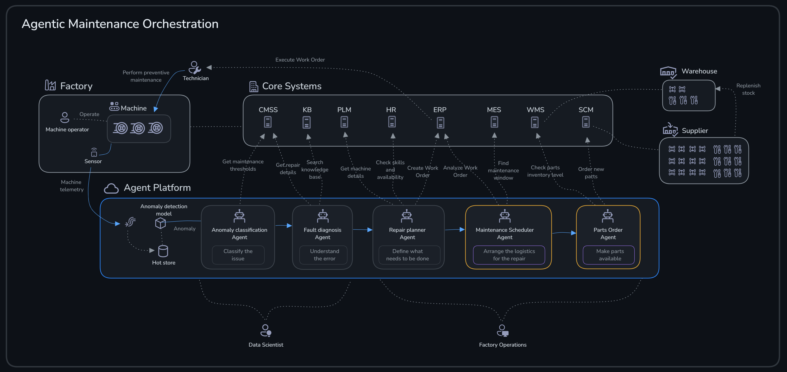
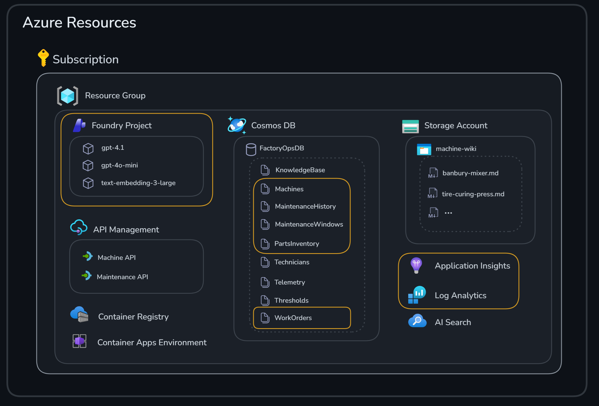
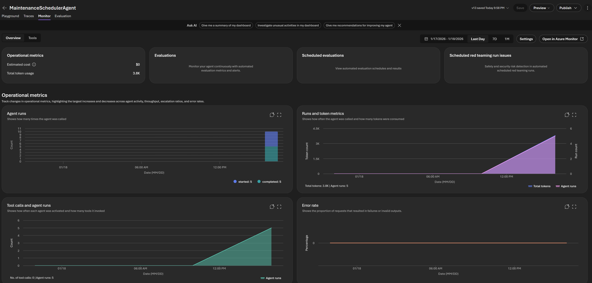
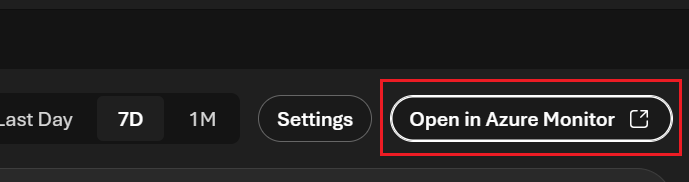
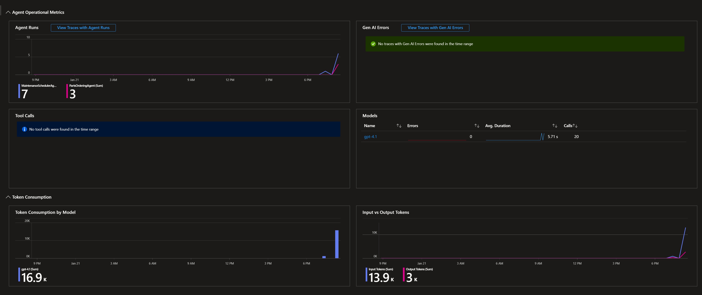
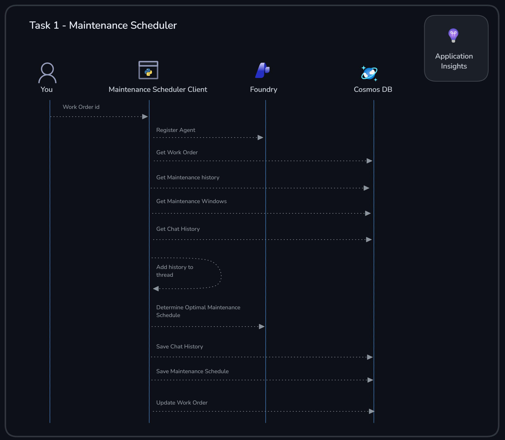
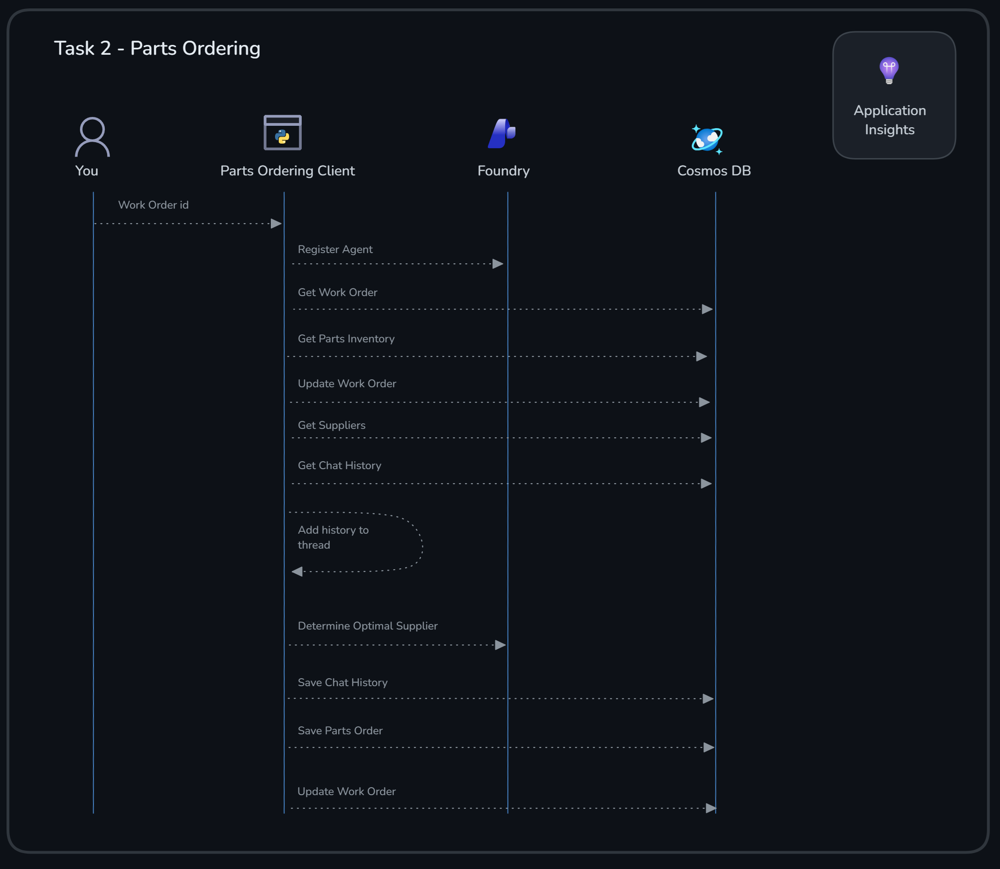
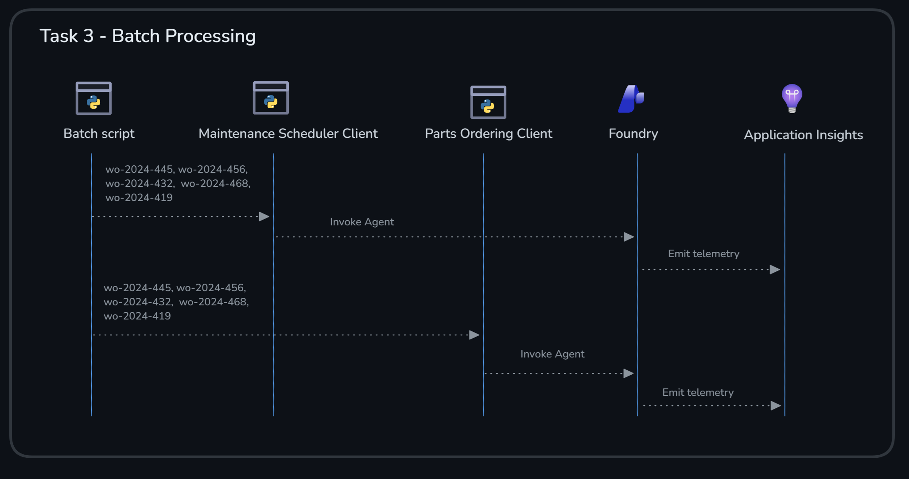

# Challenge 4 - Maintenance Scheduler & Parts Ordering Agents

**[Home](../README.md)** | [Previous challenge](challenge-03.md) | [Next challenge](challenge-05.md)

> [!TIP]
> Stuck on a step? See the [Challenge 4 walkthrough](../walkthrough/challenge-04/solution-04.md) for exact commands, expected output, and a validation checklist.

## 🎯 Objective

The goals for this challenge are:

* Use **agent memory** to maintain context across multiple interactions
* Implement **observability** with Azure AI tracing to monitor and debug agent behavior

## 🧭 Context and Background



The **Maintenance Scheduler Agent** analyzes work orders and historical maintenance data to find optimal maintenance windows that minimize production disruption. The **Parts Ordering Agent** checks inventory levels for required parts, evaluates supplier performance and lead times, and generates optimized parts orders with cost analysis.

You will use the Azure resources highlighted in the image below.



Both agents interact with **Cosmos DB** as their primary data store.

<details>
<summary>Containers used</summary>

| Container | Purpose | Agent usage |
|-----------|---------|-------------|
| `WorkOrders` | Work orders from the Repair Planner | Read by both agents to get job details |
| `Machines` | Equipment information | Referenced for machine context |
| `MaintenanceHistory` | Historical maintenance records | Read by the **Maintenance Scheduler Agent** for pattern analysis |
| `MaintenanceWindows` | Available production windows | Read by the **Maintenance Scheduler Agent** to find optimal timing |
| `MaintenanceSchedules` | Generated maintenance schedules | Written by the **Maintenance Scheduler Agent** |
| `PartsInventory` | Current stock levels | Read by the **Parts Ordering Agent** to check availability |
| `Suppliers` | Supplier information | Read by the **Parts Ordering Agent** for sourcing decisions |
| `PartsOrders` | Generated parts orders | Written by the **Parts Ordering Agent** |

</details>

<details>
<summary>Data flow</summary>

```text
┌─────────────────────────────────────────────────────────────────────────────┐
│                        MAINTENANCE SCHEDULER AGENT                          │
└─────────────────────────────────────────────────────────────────────────────┘

Input (READ):                         Output (WRITE):
├─ WorkOrders                         ├─ MaintenanceSchedules
├─ MaintenanceHistory                 │  └─ scheduled_date
├─ MaintenanceWindows                 │  └─ risk_score (0-100)
└─ Machines                            │  └─ predicted_failure_probability
                                      │  └─ recommended_action
                                      │  └─ maintenance_window
                                      │  └─ reasoning
                                      └─ WorkOrders (status update to 'Scheduled')

┌─────────────────────────────────────────────────────────────────────────────┐
│                          PARTS ORDERING AGENT                               │
└─────────────────────────────────────────────────────────────────────────────┘

Input (READ):                         Output (WRITE):
├─ WorkOrders                         ├─ PartsOrders
├─ PartsInventory                     │  └─ supplier_id, supplier_name
├─ Suppliers                          │  └─ order_items (part, qty, cost)
└─ Machines                            │  └─ total_cost
                                      │  └─ expected_delivery_date
                                      │  └─ reasoning
                                      └─ WorkOrders (status update to 'PartsOrdered' or 'Ready')
```

</details>

### Agent memory

Both agents implement **persistent memory** by storing conversation history in **Cosmos DB**. This enables an agent to maintain context across multiple interactions with the same entity (machine or work order).

Why use agent memory?

* **Contextual awareness**: an agent can reference previous interactions when making decisions, leading to more informed recommendations.
* **Consistency**: it maintains a coherent conversation thread even when sessions are interrupted or resumed later.
* **Learning from history**: the model can consider past recommendations and outcomes when generating new responses.

The conversation history is injected into the AI prompt as context, so the model can see what was previously discussed and provide more relevant responses.

### Azure AI tracing and observability

Both agents are instrumented for **end-to-end observability** so you can debug runs and understand model behavior without adding print statements everywhere.

Why observability matters — when running agents in production, you need visibility into what's happening:

* **Identify bottlenecks**: see which steps take the longest (AI inference vs. database operations).
* **Debug failures**: when an agent fails, traces show exactly which step failed and why.
* **Monitor costs**: token usage metrics help you understand and optimize AI spending.
* **Validate behavior**: confirm that agents are making reasonable decisions by reviewing their reasoning.

What's included:

* **Azure Monitor integration** — sends traces to **Application Insights**.
* **AI inference instrumentation** — automatically traces all AI model calls.
* **OpenTelemetry support** — industry-standard distributed tracing.
* **Graceful fallback** — agents work even if tracing packages aren't installed.

What you get in traces:

* **Agent execution timeline**: each step (read data, reason, write results).
* **AI model calls**: prompts, responses, token usage, and latency.
* **Cosmos DB operations**: reads/writes to containers used by the agents.
* **Failures with context**: exceptions and which step failed.

Tracing is automatically enabled when you run the agents, as long as:

1. Tracing packages are installed (already included in the project dependencies).
2. `APPLICATIONINSIGHTS_CONNECTION_STRING` is set (configured in `.env`).

The agents use **Azure Monitor** exporters to send traces, metrics, and logs directly to **Application Insights**, which integrates with the **Foundry** portal.

## ✅ Tasks

### Task 1: Maintenance Scheduler Agent

The **Maintenance Scheduler Agent** analyzes work orders and determines the optimal time to perform maintenance by balancing equipment reliability needs against production impact.

**Agent memory in action:** this agent stores chat history per machine using `get_machine_chat_history` and `save_machine_chat_history`. When the agent runs for the same machine multiple times, it can recall previous maintenance discussions and recommendations, allowing it to build on prior analysis rather than starting fresh each time.

What it does:

1. **Reads the work order** from the `WorkOrders` container.
2. **Analyzes historical data** from `MaintenanceHistory` to understand failure patterns.
3. **Checks available windows** from `MaintenanceWindows` to find low-impact periods.
4. **Runs AI analysis** using **Microsoft Agent Framework** to assess risk and recommend timing.
5. **Saves the schedule** to `MaintenanceSchedules` with risk scores and recommendations.
6. **Updates the work order** status to `Scheduled`.

#### Task 1.1: Run the agent

```bash
# Ensure you are located in the src directory
cd src

python agents/maintenance_scheduler_agent.py wo-2024-456
```

Verify that the script prints a predictive maintenance schedule with a risk score, failure probability, recommended action, and reasoning, and that the work order status is updated to `Scheduled`.

### Task 2: Parts Ordering Agent

The **Parts Ordering Agent** checks inventory availability and generates optimized parts orders by evaluating supplier reliability, lead times, and costs.

**Agent memory in action:** this agent stores chat history per work order using `get_work_order_chat_history` and `save_work_order_chat_history`. This allows the agent to maintain ordering context for each job — if a work order is processed multiple times (for example, due to partial fulfillment or changes), the agent remembers previous ordering decisions and can provide consistent recommendations.

What it does:

1. **Reads the work order** from `WorkOrders` to get required parts.
2. **Checks inventory** from `PartsInventory` to determine what's in stock.
3. **Identifies missing parts** that need to be ordered.
4. **Finds suppliers** from `Suppliers` that can provide the parts.
5. **Runs AI analysis** to optimize supplier selection based on reliability, lead time, and cost.
6. **Saves the parts order** to `PartsOrders` with order details.
7. **Updates the work order** status to `PartsOrdered` (or `Ready` if all parts are available).

#### Task 2.1: Run the agent

```bash
python agents/parts_ordering_agent.py wo-2024-456
```

Verify that the script finds the parts that need ordering, selects a supplier, and generates an order with a total cost and expected delivery date, updating the work order status to `PartsOrdered`.

Test with another work order where all required parts are already in stock:

```bash
python agents/parts_ordering_agent.py wo-2024-468
```

Verify that no parts order is needed this time, and the work order status is updated to `Ready` instead.

### Task 3: Azure AI tracing and observability

Now let's generate some trace data and explore it in the **Foundry** portal.

#### Task 3.1: Generate traces

Generate some trace data by running the batch script [run-batch.py](../src/run-batch.py), which processes five work orders through each agent, generating ten total agent runs.

```bash
python run-batch.py
```

#### Task 3.2: View traces in Foundry

1. Go to <https://ai.azure.com>.
2. Select your project.
3. Select **Agents**, then `MaintenanceSchedulerAgent` or `PartsOrderingAgent`.
4. Go to the **Monitor** tab.

You should see something similar to this:



You can examine metrics for *token usage*, *agent runs*, *tool calls*, and potential *errors*.

#### Task 3.3: View traces in Application Insights

The **Foundry** project is connected to **Application Insights**, where the monitoring data is stored. Select **Open in Azure Monitor** in the upper right corner.



This opens **Application Insights**, where you'll see similar monitoring details as in the **Foundry** portal, but you can also drill further into traces for troubleshooting purposes.



🎉 Congratulations! You've successfully worked with two agents that integrate with **Cosmos DB** and include production-ready observability.

## 🚀 Go Further

> [!NOTE]
> Finished early? These tasks are **optional** extras for exploration. Feel free to move on to the next challenge — you can always come back later!

<details>
<summary>Inspect conversation history in Cosmos DB</summary>

Open the chat history containers in **Data Explorer** and find the persisted messages for a machine or work order you've run more than once. Notice how prior reasoning is included as context for the next run.

</details>

<details>
<summary>Compare traces across runs</summary>

Run the same agent against the same work order twice and compare the two traces in Application Insights. Look for differences in token usage, latency, and the reasoning text — how much does agent memory change the second response?

</details>

<details>
<summary>Add a custom trace attribute</summary>

Extend one of the agents to emit a custom OpenTelemetry span attribute (for example, the machine's criticality level) and confirm it shows up on the trace in Application Insights.

</details>

## 🛠️ Troubleshooting

* **No traces show up in the Foundry portal:** confirm `APPLICATIONINSIGHTS_CONNECTION_STRING` is set in `.env` and that the Foundry project is linked to an Application Insights resource. Traces can take a minute or two to appear.
* **`Connection 'xxx-connection' not found` error when running agents:** this is a known intermittent issue with Foundry's MCP connection resolution (the service is in preview) — the connections exist but are not always resolved correctly by the agent runtime. Run the script again, or wait a few minutes for connection state to propagate.
* **Agent memory doesn't seem to carry over between runs:** verify the chat history container has an entry for the specific machine or work order ID — memory is keyed per-entity, so different IDs will not share history.

## 🧠 Conclusion and Reflection

In Task 1, you ran the Maintenance Scheduler Agent, which balances equipment reliability against production impact.



The agent used its memory of prior maintenance discussions for the same machine to inform its recommendation, rather than reasoning about the machine from scratch on every run.

In Task 2, you ran the Parts Ordering Agent, which evaluates supplier reliability, lead time, and cost to generate an order.



Notice how the agent produced a different outcome (order parts vs. mark the work order ready) depending purely on the current inventory state read from Cosmos DB.

Finally, in Task 3, you generated trace data and explored it in the Foundry portal and Application Insights.



> [!NOTE]
> **Why observability matters for agents:** unlike traditional deterministic code, an agent's behavior depends on the model's reasoning, which can vary between runs. Tracing lets you inspect *why* an agent made a particular decision — not just *whether* it succeeded — which is essential once you move an agentic solution from a demo into production.

If you want to learn more about what you covered in this challenge, check out the links below:

* [Azure Monitor OpenTelemetry](https://learn.microsoft.com/azure/azure-monitor/app/opentelemetry-overview)
* [Trace your application with Azure AI Foundry](https://learn.microsoft.com/azure/ai-foundry/concepts/observability)
* [Azure Cosmos DB documentation](https://learn.microsoft.com/azure/cosmos-db/)

**Next:** [Challenge 5 - Multi-Agent Orchestration](challenge-05.md)
