# Challenge 5 - Multi-Agent Orchestration with Aspire

**[Home](../README.md)** | [Previous challenge](challenge-04.md) | [Next: Wrap-up](finish.md)

> [!TIP]
> Stuck on a step? See the [Challenge 5 walkthrough](../walkthrough/challenge-05/solution-05.md) for exact commands, expected output, and a validation checklist.

## 🎯 Objective

The goals for this challenge are:

* Run an Aspire-hosted **Agent Framework** workflow end-to-end
* Understand how different agent types and hosting models work together
* Observe execution via the Aspire dashboard and traces

## 🧭 Context and Background

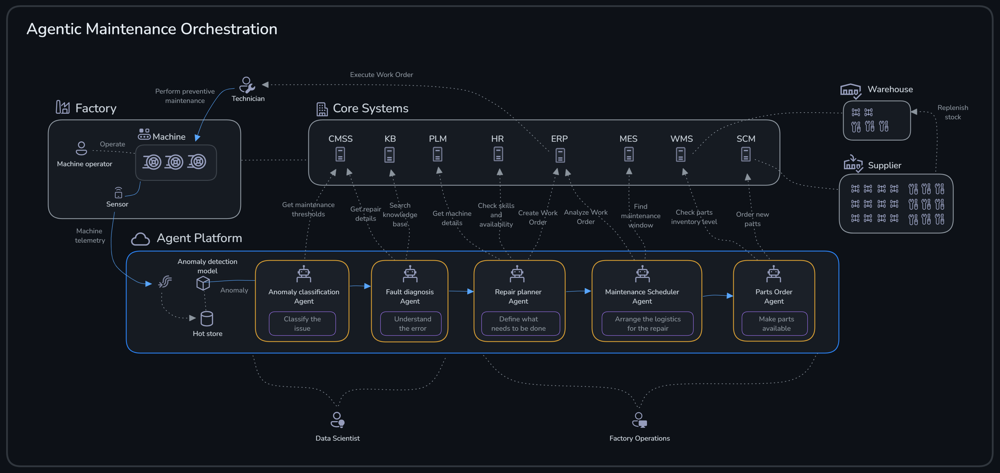

At a high level, each agent contributes a specific capability to the workflow:

* **Anomaly Classification Agent**: determines whether incoming telemetry indicates an anomaly, and classifies severity.
* **Fault Diagnosis Agent**: interprets the anomaly signals and proposes likely root causes and next checks.
* **Repair Planner Agent**: drafts a repair plan (tasks, parts, and recommended technician actions), with direct access to operational data.
* **Maintenance Scheduler Agent**: selects maintenance windows and assigns technicians based on availability.
* **Parts Ordering Agent**: reserves/requests required parts from inventory or suppliers.

This challenge demonstrates how a "real application" can orchestrate multiple agents in a workflow — where agents are not the product UI, but capabilities that enhance the solution.

Now we put all previously used Azure resources in action.

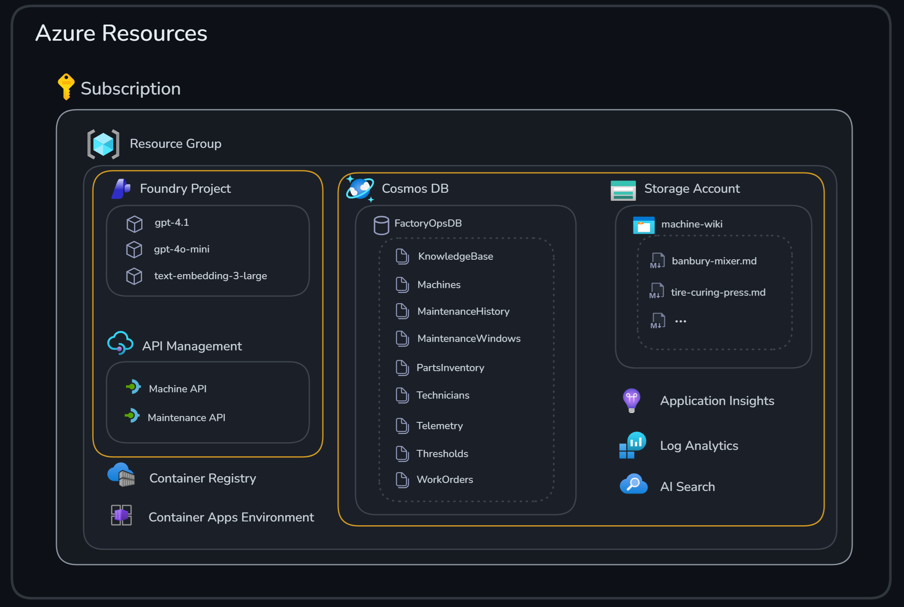

### Why Aspire (workflow host)

We use **.NET Aspire** as the host for the workflow. Aspire is an opinionated framework for building distributed applications, and it's a good fit here because:

* It gives a consistent developer experience for running multi-service apps locally.
* It provides a built-in dashboard for observability.
* It supports polyglot solutions (this project includes both .NET and Python components).

In practice, that means Aspire can orchestrate both .NET services and Python processes side-by-side, which is exactly what we need for this multi-agent workflow.

In other words, Aspire is the "glue" that runs the workflow host, API, UI, and agent processes together and gives you one place to see logs, health, and traces. For agentic systems, that observability is especially useful because a single user action can fan out into multiple agent calls and tool invocations.

### Agent-to-Agent (A2A) invocation

This solution includes different types of agents:

* **Anomaly Classification Agent** and **Fault Diagnosis Agent**
  * Defined in Python
  * Running fully in **Foundry Agent Service** (no local execution)
* **Repair Planner Agent**
  * Implemented in C#
  * Runs with local logic and direct access to data sources like **Cosmos DB**
  * Invoked from the workflow using **Agent-to-Agent (A2A)**
* **Maintenance Scheduler Agent** and **Parts Ordering Agent**
  * Python agents with local logic
  * Invoked with A2A similar to the **Repair Planner Agent**

**A2A** is a pattern for letting a workflow invoke an agent through a consistent interface, so you can combine independently implemented agents without tightly coupling everything together.

This matters in a polyglot setup: the workflow can call an agent implemented in a different language (or hosted in a different process) the same way it calls any other agent. It also gives you a clean boundary between orchestration (the workflow) and capabilities (the agents), which makes the system easier to evolve over time.

#### Publishing agents via Azure API Management

In Challenge 2, we explored how to use [API Management as an AI gateway](challenge-02.md#api-management-as-ai-gateway) for governing and securing access to AI services. **Azure API Management** can also be used to publish agents as A2A endpoints, enabling governed agent-to-agent communication at scale.

With **API Management** as an A2A gateway, you get:

* **Centralized agent discovery**: agents can be registered and discovered through a unified gateway.
* **Security and authentication**: apply consistent authentication, authorization, and rate limiting policies across all agent endpoints.
* **Observability**: monitor agent invocations, latencies, and errors through APIM's built-in analytics.
* **Protocol translation**: APIM can handle protocol differences and provide a consistent A2A interface regardless of the underlying agent implementation.

This approach is particularly valuable in enterprise scenarios where you need to expose agents to multiple consumers while maintaining governance and control over how agents are accessed and invoked.

### Agent Framework workflows

The **Microsoft Agent Framework** provides *orchestrations* — pre-built workflow patterns with specially-built executors that allow developers to quickly create complex workflows by simply plugging in their own AI agents.

#### Why workflows matter

Traditional single-agent systems are limited in their ability to handle complex, multi-faceted tasks. By orchestrating multiple agents, each with specialized skills or roles, you can create systems that are more robust, adaptive, and capable of solving real-world problems collaboratively.

#### Supported orchestrations

The **Agent Framework** supports several orchestration patterns, each suited to different scenarios:

| Pattern | Description | Typical use case |
|---------|-------------|-------------------|
| **Concurrent** | A task is broadcast to all agents and processed concurrently | Parallel analysis, independent subtasks, ensemble decision making |
| **Sequential** | Passes the result from one agent to the next in a defined order | Step-by-step workflows, pipelines, multi-stage processing |
| **Group Chat** | Assembles agents in a star topology with a manager controlling the flow of conversation | Iterative refinement, collaborative problem-solving, content review |
| **Magentic** | A variant of group chat with a planner-based manager (inspired by MagenticOne) | Complex, generalist multi-agent collaboration |
| **Handoff** | Assembles agents in a mesh topology where agents can dynamically pass control based on context without a central manager | Dynamic workflows, escalation, fallback, or expert handoff scenarios |

This challenge uses the **Sequential** pattern — see [Conclusion and Reflection](#-conclusion-and-reflection) for why that fits this scenario.

## ✅ Tasks

> [!IMPORTANT]
> This workflow expects the **Anomaly Classification** and **Fault Diagnosis** agents to be hosted in **Foundry Agent Service**. Make sure you've completed [Challenge 2](challenge-02.md) before starting the workflow.

### Task 1: Start Aspire

```bash
cd src/agent-workflow
aspire run
```

### Task 2: Make the workflow API port public (Codespaces)

The workflow API runs on port `5231`. In VS Code / **GitHub Codespaces**:

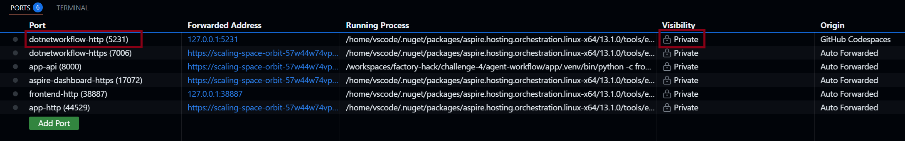

* Open the *Ports* tab
* Find port `5231`
* Set *Port Visibility* to *Public*

> This allows the frontend to call the API from the browser.

### Task 3: Open the frontend

Once Aspire is running, it provides links in the output.

* Click the *frontend* link — you should see an app similar to the screenshot below

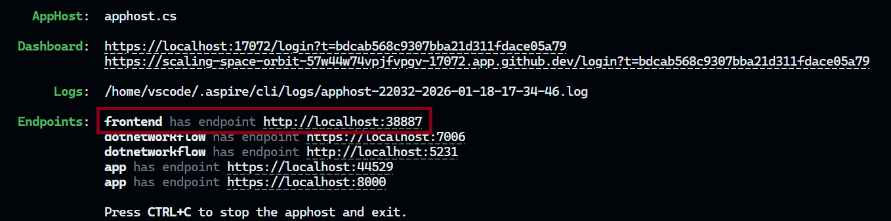

* Click the link (using Alt+Click)

The Factory Workflow UI opens in your browser:

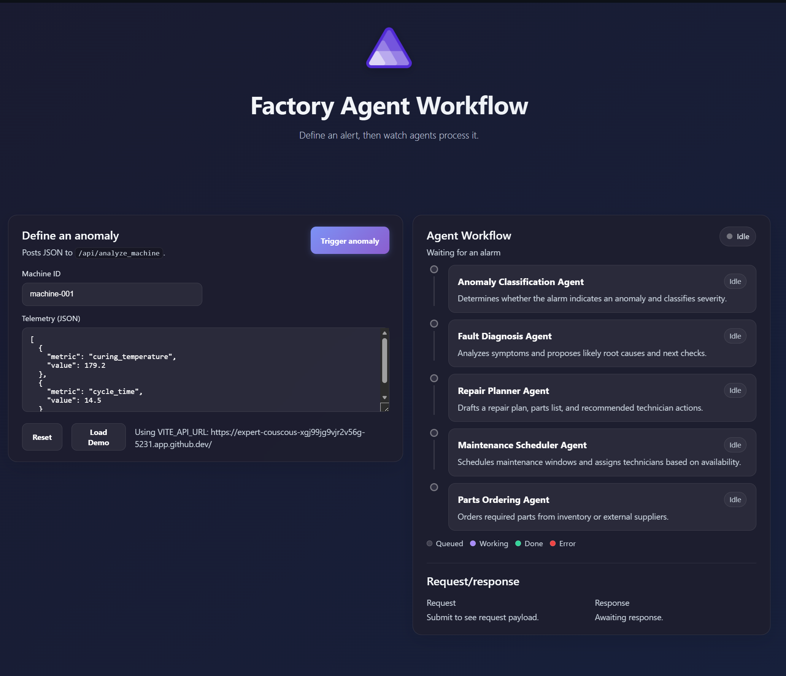

### Task 4: Run the workflow

Click the *Trigger Anomaly* button. In the frontend, watch the *Agent Workflow* panel as the workflow progresses through:

* **Anomaly Classification Agent**
* **Fault Diagnosis Agent**
* **Repair Planner Agent**
* **Maintenance Scheduler Agent**
* **Parts Ordering Agent**

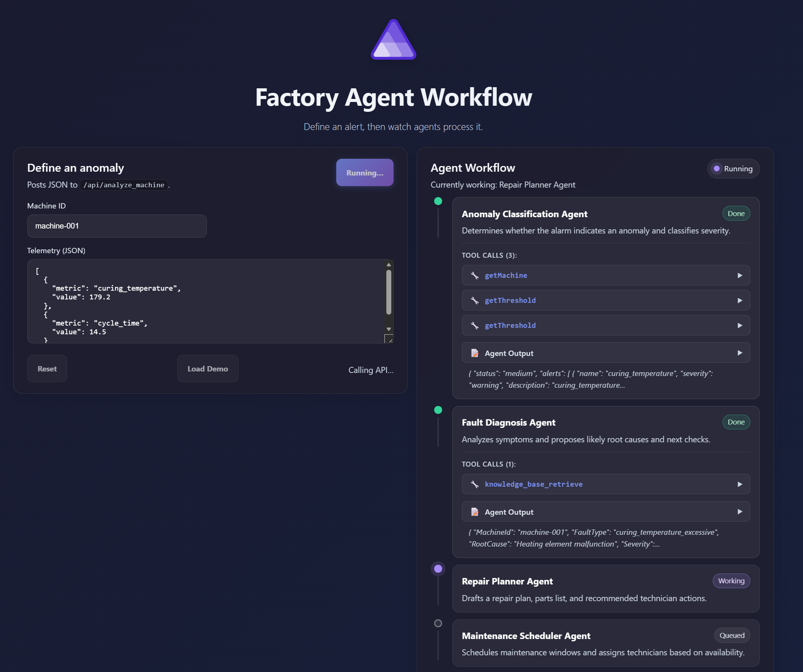

You should see steps move through states (queued/working/done/error). You can expand the tool call details and agent output:

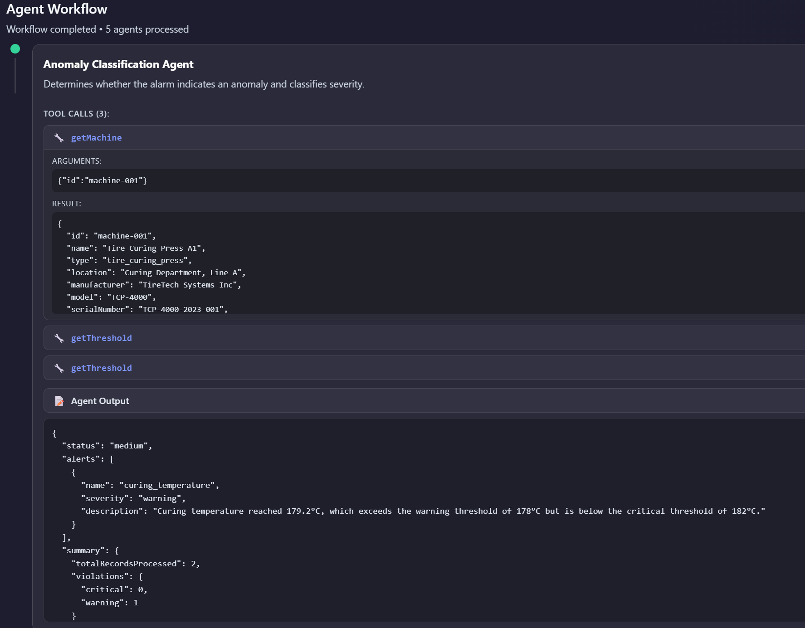

When finished, you should see something similar to this:

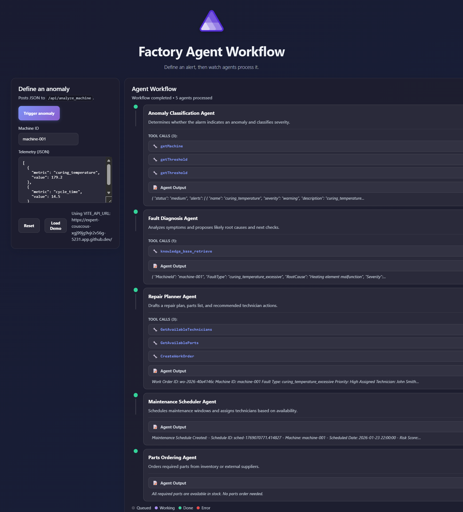

### Task 5: View the dashboard

Aspire includes a dashboard to observe running services.

* In the Aspire output, click the *dashboard* link (using Alt+Click)

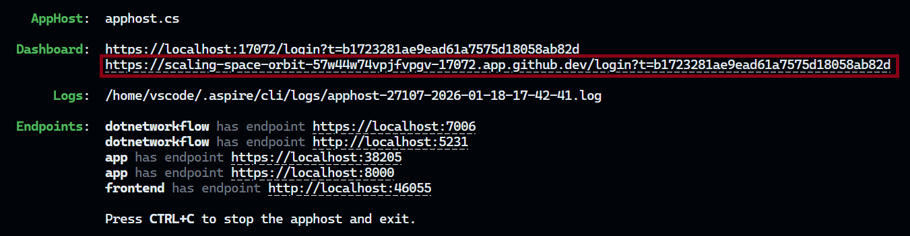

The dashboard starts in your browser and shows the resources:

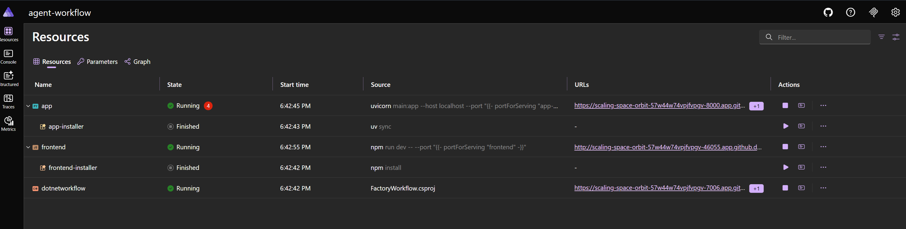

* Click *Console* to see the invocation chain in the workflow

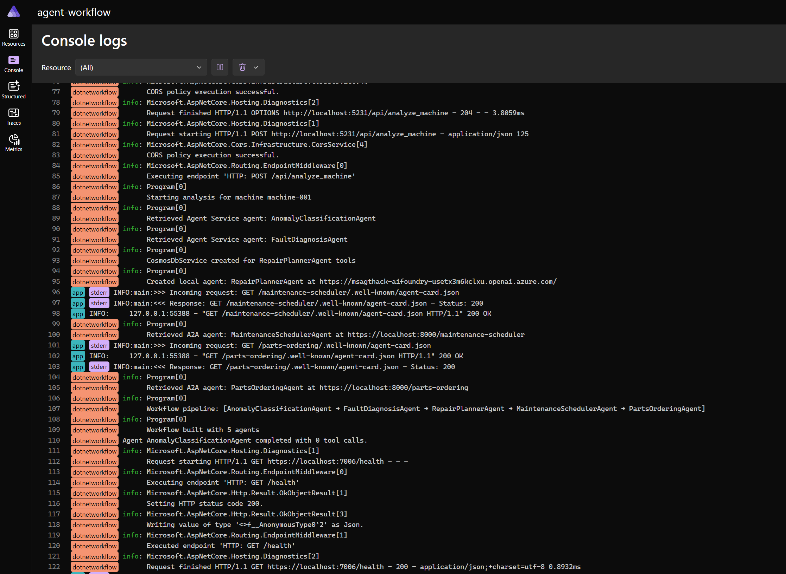

* Click *Traces* to see call duration details

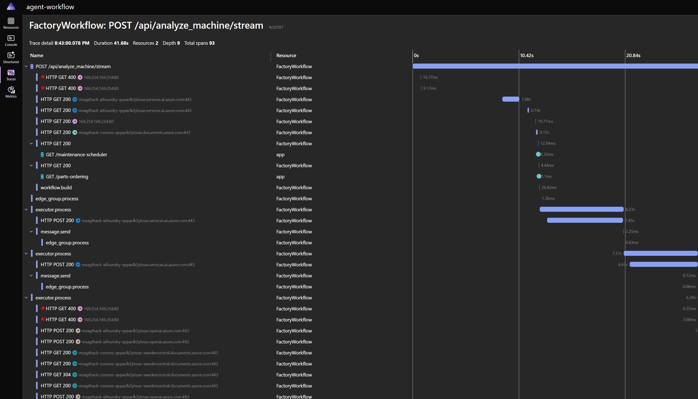

🎉 Congratulations! You've successfully completed the final challenge.

## 🚀 Go Further

> [!NOTE]
> Finished early? These tasks are **optional** extras for exploration.

<details>
<summary>Add an Executive Summary Agent to the workflow</summary>

Create a new **ExecutiveSummaryAgent** that takes the combined output from the final agent in the workflow and produces a concise, business-friendly summary of the entire maintenance operation.

What to explore:

* Create the agent in **Foundry Agent Service** (using a Python script or the Foundry portal UI).
* Update the Aspire workflow code to chain this new agent as the **last step** in the sequential orchestration.
* Consider what information from the previous agents would be most valuable in an executive summary.

This task exercises your understanding of how to extend an existing Aspire-hosted workflow with additional agents.

</details>

<details>
<summary>Build a declarative workflow in the Foundry portal</summary>

Use the **Foundry portal** to create a declarative workflow that combines multiple agents without writing orchestration code.

What to explore:

* Use the existing **AnomalyClassificationAgent** and **FaultDiagnosisAgent** (already deployed in Agent Service).
* Create a new **ExecutiveSummaryAgent** that summarizes the findings from the previous two agents.
* Stitch all three agents together into a single declarative workflow using the Foundry portal UI.

This task lets you compare the declarative (portal-based) approach to workflow definition versus the programmatic (Aspire-hosted) approach you used in this challenge.

</details>

<details>
<summary>Deploy to Azure Container Apps</summary>

In this challenge we ran Aspire locally for development, but the same pattern can be deployed as a hosted application. The lab environment includes both an **Azure Container Registry** and a **Container Apps Environment**.

Try packaging the workflow host and frontend, and deploying them:

1. Build container images for the workflow services.
2. Push images to **Azure Container Registry**.
3. Deploy to **Azure Container Apps**.
4. Configure environment variables for the deployed services.

</details>

<details>
<summary>Explore the Aspire dashboard traces</summary>

The Aspire dashboard provides detailed distributed traces. Try:

* Clicking on individual trace spans to see timing details.
* Following a request through multiple services.
* Identifying bottlenecks in agent invocations.

</details>

<details>
<summary>Add custom telemetry</summary>

Extend the workflow with custom telemetry:

* Add custom metrics for agent response times.
* Create custom spans for specific operations.
* Export traces to **Application Insights**.

</details>

## 🛠️ Troubleshooting

* **`aspire` / `aspire run` is not found:** install it and restart your shell session:

  ```bash
  curl -fsSL https://aspire.dev/install.sh | bash -s
  ```

  If you're using a `.env` file, load it into your current shell session with `export $(cat .env | xargs)`.

* **HTTP 401 / `PermissionDenied` when calling model endpoints:** this usually means your identity is missing **Azure OpenAI** data-plane permissions on the **Azure OpenAI** resource. Ensure you have **Cognitive Services OpenAI Contributor** (or **Cognitive Services OpenAI User**) assigned at the resource scope.
* **The frontend loads, but calls to `/api` fail:** confirm port `5231` is forwarded and set to *Public* in the *Ports* view, confirm the frontend is pointing at the correct API URL, and check the Aspire dashboard logs for CORS or network errors.
* **The workflow can't find your Foundry project endpoint:** make sure `AZURE_AI_PROJECT_ENDPOINT` is set in the shell that runs `aspire run`:

  ```bash
  echo "$AZURE_AI_PROJECT_ENDPOINT"
  ```

## 🧠 Conclusion and Reflection

You've now run an end-to-end, polyglot agent workflow hosted with Aspire. Let's reflect on how the different pieces fit together.

### Sequential orchestration in this challenge

In this challenge, we used a **sequential orchestration** to process telemetry anomalies. The workflow passes results from one agent to the next in a defined order:

```text
Anomaly Classification → Fault Diagnosis → Repair Planner → Maintenance Scheduler → Parts Ordering
```

This linear flow makes sense for our scenario because:

1. **Anomaly Classification** must first determine *if* there's a problem and its severity.
2. **Fault Diagnosis** needs the classification result to identify the root cause.
3. **Repair Planner** requires the diagnosis to create an appropriate repair plan.
4. **Maintenance Scheduler** uses the repair plan to schedule the work.
5. **Parts Ordering** needs the scheduled work order to reserve required parts.

Each step builds on the previous one — you can't schedule maintenance without knowing what needs to be fixed, and you can't order parts without knowing when the work will happen. The sequential orchestration ensures this dependency chain is respected while keeping the workflow definition simple and readable.

### Workflow architecture

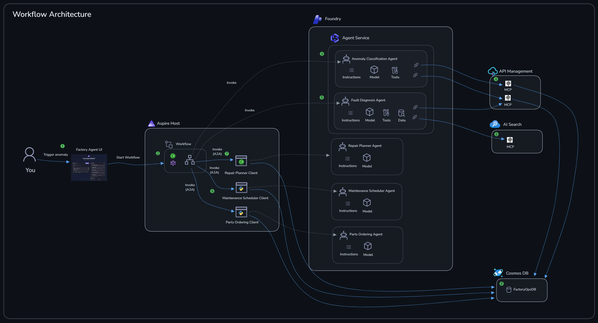

The diagram above illustrates the full workflow in nine steps:

❶ A user triggers a sample anomaly in the Aspire **Factory Agent UI** (sample machine + sample metrics).

❷ The **agent framework workflow** (implemented in .NET) is triggered.

❸ The workflow invokes the **Anomaly Classification Agent** running in **Foundry Agent Service**.

❹ The **Anomaly Classification Agent** uses remote MCP tools to call **API Management** and fetch required data.

❺ The workflow invokes the **Fault Diagnosis Agent** running in **Foundry Agent Service**.

❻ The **Fault Diagnosis Agent** uses remote MCP tools to call **API Management** and query **Azure AI Search**.

❼ The workflow invokes the **Repair Planner Agent** locally via A2A, running as a .NET application. It still uses the agent registration in **Foundry**, but executes its logic locally.

❽ The **Repair Planner Agent** queries **Cosmos DB** locally to retrieve operational data.

❾ The final two agents (**Maintenance Scheduler Agent** and **Parts Ordering Agent**) are implemented in Python and also run locally in a separate process (similar to the **Repair Planner Agent**). They're invoked via A2A and query **Cosmos DB** directly.

In this challenge, you built and ran a solution where agents are **part of the application**, not the entire application.

* **Choosing different tech stacks is a feature, not a bug**: you can implement agents in Python or C# depending on what they need to do (data access, performance, existing libraries, team skills).
* **Agents can be polyglots**: different agents can be built in different languages and still work together through standard invocation patterns (like A2A).
* **This is close to traditional application development**: you still assemble services, define interfaces, configure environments, and diagnose issues with logs and traces — agents simply enhance the solution's capabilities.

### Alternative: DevUI for lightweight workflow visualization

In this challenge we used **Aspire** as the workflow host, which provides comprehensive orchestration and observability for multi-service applications. However, if you only need simple workflow visualization during development — without the full Aspire infrastructure — the **Agent Framework** also includes **DevUI**.

**DevUI** is a lightweight development tool that provides:

* Real-time visualization of agent workflow execution
* Inspection of agent inputs, outputs, and tool calls
* A simpler setup for quick iteration during development

DevUI is ideal when you're focused on debugging a single agent or workflow and don't need the full distributed tracing and service orchestration that Aspire provides.

If you want to expand your knowledge on what we've covered in this challenge, have a look at the content below:

* [Microsoft Agent Framework Workflows](https://learn.microsoft.com/agent-framework/user-guide/workflows/overview)
* [What is .NET Aspire?](https://aspire.dev/get-started/what-is-aspire/)
* [Agent-to-Agent in Foundry](https://learn.microsoft.com/azure/ai-foundry/agents/how-to/tools/agent-to-agent?view=foundry&pivots=python)
* [Agent-to-Agent API in Azure API Management](https://learn.microsoft.com/azure/api-management/agent-to-agent-api)
* [DevUI for Agent Framework](https://learn.microsoft.com/agent-framework/user-guide/devui/?pivots=programming-language-csharp)

---

You've now completed the final challenge of the Predictive Maintenance multi-agent workflow hack. You have a complete, end-to-end agentic system that combines:

* **🤖 AI-powered agents** for anomaly detection, diagnosis, and planning
* **🔌 MCP integration** for governed, extensible tool connectivity
* **📊 Observability** with Aspire dashboard and traces to monitor and debug execution
* **🖥️ A web frontend** for business-user interaction and workflow visualization

Your system is ready to be extended with additional agents and tools, integrated with other enterprise systems, and deployed to a hosting environment (for example, as a containerized application). Great work!

**Next:** [Wrap-up](finish.md)
